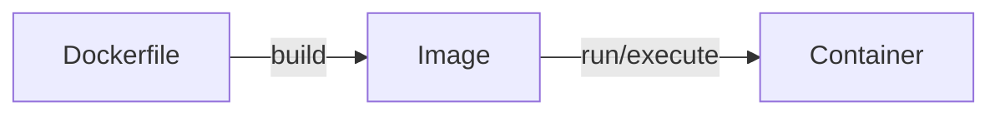

# Using Docker for Environment Management

## Motivation

* Previously we spoke about how Python environment management is a complex web of different technologies: Brew, Conda, pyenv, virtual env, etc.
* On most computers the `python` executable command points to a placeholder file which redirects the user to specific executable files based on the conditions set forth by the environment management software.
* On the shell level, this redirect is controlled via the `PATH` environment variable. 
  - On my computer, for example I have installed both `conda` and `pyenv`, however, `pyenv` location of Python is listed _before_ the conda version, so that when I run python in the terminal the conda version is ignored.
  - This also means that I can type `conda install` to install things, _but they do not effect my python because `conda` is not the version of python actually installed.
<!-- Add graphic here showing terminal -> path -> /user/bin/pyenv/shims/python (??) -> different pythons and numpy versions -->
* Relying on `PATH` to control what runs puts a lot of pressure on the user to have their environment set up correctly.
* Most people end up with a complex, unique web of environment variables, python packages and other software that is both confusing, when required to install additional software and non-transferable to other users. A lot of "This works on my computer, why doesn't it work on yours?"
* AND, even if you get this working at the Python package level there are lots of pieces of software which require a tighter integration with the operating system and, as such complicate the above situation. Example of such software includes:
  * [GDAL](https://gdal.org/en/latest/) for doing geospaital work
  * [Webdrivers](https://www.selenium.dev/documentation/webdriver/) such as those used for headless web scrapping with selenium
  * Database Adapters, such as [psycopg2](https://pypi.org/project/psycopg2/)
* Basically anything that relies upon tighter hooks into the operating system can frequently "break" python environment management solutions. 
* Tools like `brew` and `conda` often get around this by integrating more deeply into the operating system, but they also come with downsides.

## Docker
- The most common solution for solving complex environment management is [Docker](https://www.docker.com/).
- Docker attempts to solve the following problems:
  - **Consistency:** No more "it works on my machine".
  - **Isolation:** Things inside my environment do not seep outside my environment in unexpected ways. I can also set up multiple environments on my computer in different ways that are easy to use.
  - **Resource Efficiency:** I can set limits on how my computers' resources are used by the container (GPU, CPU, Memory, Hard Drive, etc.)
  - **Environment Management Versioning:** Since my environment is managed by a text file I can have "versions" of the environment, just as I do with other software.
  - **Transferability:** I want to transfer my environment to another person's computer.
  
### Components and Language
- Docker consists of the following components:
  - **Host:** How we describe the computer that our environment is going to sit in.
  - **Docker Engine:** The software that runs docker on the host.
  - **Dockerfile:** This is the step-by-step code which we will use to define the environment we want to create.
  - **Image:** The image is the software template that is created ("built") by the Dockerfile
  - **Container:** A container is an image that is "live" and running.
<!-- markdown-link-check-disable -->
  - **Registry/Hub:** A registry of containers that is already built so that we do not have to start from scratch each time we build a new container. The most commonly used one is [DockerHub](https://hub.docker.com/) which you logged into when you installed Docker.
<!-- markdown-link-check-enable -->


- The Docker Engine runs on top of the host machines' operating system, but inside each container is another operating system.
- We can choose whatever operating system we want to put in the container when we write our Dockerfile.

## Our first Dockerfile

- In this section we are going to create a Dockerfile and associated code which will print ASCII art of today's date using the [art module](https://pypi.org/project/art/).
- The final working example can be found in the [lecture examples docker](../lecture_examples/03_docker_art/) directory.
- When we begin a Dockerfile we (almost always) start from another image that someone else built. 
- We use the command `FROM` to designate what image we want to be our "base" image. 
<!-- markdown-link-check-disable -->
  - We usually get base images from an image registry. The default when using docker is [dockerhub](https://www.dockerhub.com). When you install docker you are asked to register for an account from this site. 
<!-- markdown-link-check-enable -->
  - Images follow the the naming convention where there is a `:` followed by a _tag_. The tag denotes a specification of the image. 
  - When looking at tags on a image registry such as dockerhub there are a number of common tagging structures.
  - For example, consider the image provided for [python](https://hub.docker.com/_/python). On this page the tags look like `3.10.15-bookworm`. The first number in this example (`3.10.15`) represents the version of python that is going to be installed if you use the image with this tag. The second component `bookworm` is the nickname for a version of [Debian](https://wiki.debian.org/DebianReleases), one of the most common versions of Linux used to build images. 
- Other common operating system designations are: `slim` and `alpine` which have different underlying operating systems. Why would people use different versions? Each operating system has different strengths and weaknesses; different systems are also different sizes. Smaller sizes mean faster performance but at the cost of features, but can make a large difference is putting into production. 

<div align="center">
<table>
  <thead>
    <tr>
      <th>Python Image</th>
      <th>Image size</th>
    </tr>
  </thead>
  <tbody>
    <tr>
      <td>Alpine</td>
      <td>20 MB</td>
    </tr>
    <tr>
      <td>Slim</td>
      <td>50 MB</td>
    </tr>
    <tr>
      <td>Bookworm</td>
      <td>350 MB</td>
    </tr>
  </tbody>
</table>
</div>


- Below is our first Dockerfile, a few important notes:
  - The file needs to be saved as a _text_ file. Use VSC or another editor designed for working with text when editing. VSC has a pretty good Docker extension that does syntax highlighting and such.
  - The file name needs to be `Dockerfile` with out an extension. 
- The second command that we used is `WORKDIR`. This command does two things: it creates the directory if it does not exist AND it sets the current working directory.

```
FROM python:3.10.15-bookworm
WORKDIR /app
```

## Building and Running

- Now that we have a Dockerfile we want to build the image and then run it, creating a container.
- To build the Dockerfile we type in:

```bash
docker build . -t myfirstdocker
```

- This command needs to be executed in the directory with the Dockerfile. The `.` represents the current directory and tells the `docker` command to look in this directory for the Dockerfile
- The `-t myfirstdocker` labels or _tags_ the image with the name `myfirstdocker`. This is how we will reference the image going forward.
- Once the container is built then we can run or execute it using the `docker run` command. 
- We'll start by creating an interactive bash session inside the container by telling docker to run the container interactively and pointing to `/bin/bash` as the command to execute:

```bash
docker run -i -t myfirstdocker /bin/bash
```

- If you run this command successfully look at the prompt! You'll see that it has changed because now you are running `bash` _inside the container_!
- To exit the container we type `exit` or hit `CTRL-d`.
- Just like before you can combine options: `docker run -it myfirstdocker /bin/bash` which will do the same thing.
- IMPORTANT (and we will talk about this later), the `-t` option does _not_ refer to the tag of the container. 
- Running the container that we can verify that there is nothing in it by typing `ls`. While there are files in the directory in the host machine that we created the container in there are no files in the container itself -- that is because the container is isolated. 
- The syntax of `docker run` that we are using is:

```bash
docker run [options] image-to-build [optional executable file]
```
  
- In the example that we just did our options are `-i` and `-t` and we gave it an optional executable, in this case the command `/bin/bash` which directs the docker engine to spin up the container and then start the process that can be found at `/bin/bash`.

### Adding additional environment information

- At this point in time we want to add the ability to print things with the `art` module in python. 
- We will use a `requirements.txt` file and install it via `pip`.
- To identify which version to install we can go inside the container install it, get the version and then add that to `requirements.txt`
  - First enter the container if you have not already `docker run -it myfirstdocker /bin/bash`
  - Assuming that you are inside the container then we can install the art module using `pip install art`
  - There are many ways to get the version. My preferred method is to do `pip freeze | grep art` which returns the package version information in the format required for `requirements.txt`. Running it now I see `art==6.3`.
  - On the host machine (_outside the container_) create a file `requirements.txt` and add the line `art==6.3` to it.
- Now that we have the file we need to incorporate it into our build process using the `Dockerfile` by adding the following lines:

```
FROM python:3.10.15-bookworm
WORKDIR /app

COPY requirements.txt .
RUN pip install -r requirements.txt
```

- The `COPY` command in a Dockerfile copies a file from the host machine (outside the image) to inside the image.
- The `RUN` command runs, inside the container the command that follows. In this case it is going to run the pip install command which should then instal the `art` package.
- We can then re-build the container and verify by:

```bash
docker build . -t myfirstdocker
docker run -it myfirstdocker /bin/bash
```

Once we are inside the container, execute `python` and test by checking to see if the `art module` was installed (`import art`). 

### Using the art package and running a command

- At this point lets create a python file (`print_date.py`) and put it in the same folder as the Dockerfile and the `requirements.txt` file.
- We want it to print the current date using the `text2art` in the `art` package. 


```python
from datetime import datetime
from art import text2art

def todays_date_in_str_art():
    date_str = datetime.now().strftime('%m/%Y')
    ascii_art_date = text2art(date_str, font='block')
    return ascii_art_date

if __name__ == "__main__":
    print(todays_date_in_str_art())
```

- To get this to run we add the following to our Dockerfile to get it to execute the python file above

```
FROM python:3.10.15-bookworm
WORKDIR /app

COPY requirements.txt .
RUN pip install -r requirements.txt

COPY print_date.py .
CMD ["python", "print_date.py"]
```

- The `COPY` command we have seen before, but `CMD` is new. 

- Now, after re-building the container and running it we will see the ascii art of today's date!

```bash
docker build . -t myfirstdocker
docker run myfirstdocker
```

- In the above we changed the `run` command in three very important ways:   
  1. removed the `-i` flag 
  2. removed the `-t` flag
  3. removed the `/bin/bash` 

- Without getting too much into the technical details the flags above deal with the following:
  - When we want to run an _interactive_ session which allows us use our keyboard to interact with the container we have to use `-i` to denote that we want to interact directly with the container and `-t` to tell docker to link our keyboard with the session. 
  - When we do `docker run` with `/bin/bash` our intention is to create a container where the shell (`/bin/bash`) is running that we connect to so that we can interact with it. To have that interaction occur we need both the `-i` and `-t` flag to properly route both the input and output of the container to our screen.

- When we removed the `/bin/bash` the `docker run` command executes what is found in the `CMD` command in the docker file. You can think of it like this -- if there is a command at the end of `docker run` this takes priority over what is in `CMD`, but if there is no command provided as an argument then whatever is in `CMD` is executed instead.

### CMD, docker run and the i & t flags

- When first working with `docker` the interaction of the `-i`, `-t` and the `CMD` command can be confusing. A few important things to keep in mind about this:

- If we just want to run what is in `CMD` inside the docker file we:
  - do not provide any type of command argument to the tail of the `docker run` command
  - do not need to add `-i` or `-t` to the `docker run` command, but adding it (generally) won't make too much of a difference.

- If we want to run a different command that what is specified in `CMD` then we have a few options:
  - If we want to run something interactively, such as a `bash` session, then we need to add `-i` and `-t` as well as provide the location of the `bash` shell (usually `/bin/bash`) to the `docker run` command.
  - If we want to run another executable file _not_ interactively, but that is also in the container then we do not need to add `-i` and `-t`, but we do need to specify the location of the executable at the end of the `docker run` command.

