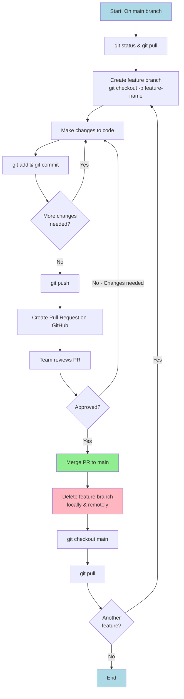

# Git Expectations and Docker Environment Variables

## Git Expectations

- In this course you will be expected to use git and GitHub, using branches and merges, in order to work with your peers.
- In terms of the commands you would be expected to know:
  - `git pull`
  - `git push`
  - `git checkout`/`git switch`
  - `git commit`
  - `git add`
  - `git status`
  - `git fetch`
- These commands have tons of options so you don't need to know everything about them, but you do need to know their core functionality. If you don't recall these specifically from your previous classes, please spend some time getting up to speed the best way you know how, be that videos, books, or your previous class notes.

### Git Grading

- There are a number of important things that we will grade your repository on during this course. These are generally considered best practices, so becoming familiar with the underlying motivation and how to execute on them is useful:
  1. No direct commits to the `main` branch. All code _must_ be put on a branch and merged in a pull request ("PR").
  2. Branches need to have lifetimes. Branches should have a target, such as a specific feature that you are implementing. 
     - New users to git often create a single branch (`NickBranch`) that they commit over and over again to the `main` branch. This isn't a good practice; branches should have a specific lifetime attached to a specific need.
     - Best practice is to create a branch for each feature or task you are working on. After merging your branch in with `main`... DELETE IT!
  3. Branch protections must be turned _on_ for the `main` branch to avoid accidental commits to that branch (more info on how to do this can be found in the assignment folder).
  4. When you turn in your assignment you will get the commit hash (`sha` pronounced "shaw") of the specific place in the code that you want graded and will provide it via the assignment. (Show how to find on github.com).
     - Because the commit hash is attached to a specific state of the code future changes will not affect it and we can be assured that we are both looking at the same place.
     - When grading your code we will checkout that specific code location.

### How to use Git and NOT get in trouble

Git is a complex piece of software and the first time you use it, it can feel overwhelming. Here are some best practices that you should use to minimize the likelihood of painting yourself into a corner:

* Always know where you are starting from and verify with `git status` and `git pull` to make sure that you are up to date. When code is pushed to the `main` branch by someone else on your team you'll need to make sure to checkout your own, local, version of `main` and pull before creating a new branch.
* Commit _frequently_ on your own branch.
* Work _together_ on PRs. The code base we are working on isn't that large so everyone should be keeping an eye on all aspects of it.
* Work in isolation: make sure that individuals are working on different sections of the code base. Having two people work on the same section of the code base is a quick way to end up with a confusing set of merges.
* Spend time designing _before_ coding. The most common place in the code where version control issues appear is on interfaces between different pieces of code. Spend time making sure that places where your code touches others is well-defined! Do you know what inputs and outputs are coming into and out of each function / element? How are they intended to interact?

### How to use git and get in trouble

* Ignore the messages that git is sending you on the command line without making sure they are what you expect before continuing.
* Blindly copy code from stack overflow or an LLM without understanding what it is trying to do.

### Git Workflow Diagram



## Passing Data into Docker containers

* We are going to focus on the isolation afforded by Docker.
* One of the powerful features of Docker is that it isolates the host computer from the container. This power also means that passing data and information from the host to the container can be complex. In this section we are going to begin a discussion about how to pass data.
* We will focus on three different types of data and identify the three primary times when we want to inject data into the containers.
* We have already covered a few of these options, but in this section we'll specifically cover environment variables.

<figure>
  <figcaption style="text-align: center; font-weight: bold;">Passing Data into Docker containers</figcaption>
<table>
  <tr>
    <th></th>
    <th>Transfer at Build</th>
    <th>Transfer at Run</th>
    <th>Live Container</th>
  </tr>
  <tr>
    <th>ENV Vars</th>
    <td>ENV Command in Dockerfile</td>
    <td>Use <code>-e</code> flag on the <code>run</code> command</td>
    <td style="text-align: center;">✖</td>
  </tr>
  <tr>
    <th>Files</th>
    <td>COPY command in the Dockerfile</td>
    <td style="text-align: center;">✖</td>
    <td>Mount volumes using the <code>-v</code> flag on the <code>run</code> command</td>
  </tr>
  <tr>
    <th>Network</th>
    <td style="text-align: center;">✖</td>
    <td style="text-align: center;">✖</td>
    <td>Mount ports using the <code>-p</code> flag on the <code>run</code> command</td>
  </tr>
</table>
</figure>

### Transfer at Build

- The first time that we can put data into the container is at build.
- We use this frequently when we set up our initial environment inside the container, but because of the cons listed below this has very limited use beyond this purpose.
- **PROS:** The biggest pro of putting data into the container at the time of the build is ease. This is, by far, the easiest and most consistent way to get things into the container.
- **CONS:** The major con is that if you put data into the container at the time of the build then every time your data changes you'll need to rebuild the container which is a time consuming process which can impede developer efforts.


### Transfer at Run

- The second time we can put data into the container is when we execute `docker run`. 
- Data put into the container at this time will remain static through the lifetime of the container, but can be easily refreshed by exiting and restarting the container.
- This is used frequently when we pass data in that should be relatively stale over the session. Things like API Keys, specific parameters or data locations, etc.
- **PROS:** No need to rebuild the container when data changes
- **CONS:** Requires additional command line arguments that can be fickle to implement. Container restart required when data changes.

### Live container

- The final option, which we really only do for file systems and network data is opening a connection between the host and the container. This type of "live" connection is incredibly powerful since any data change, on either side, is mimicked in the other location. 
- This type of bilateral exchange is very common, but does require us to be careful since we are losing a bit of the security generated from the inherent Docker isolation. 
- **PROS:** Everything changes on both sides. Most complete type of data exchange.
- **CONS:** Complex, harder to set up, can create interesting side effects that are hard to track down. Less secure since the connection is open.


## Environment Variables

- In this section we'll demonstrate how to transfer data into a Docker container using environment variables at the time of build and at the time of run.
- We will first start with our basic Dockerfile that we have been working with this entire time.

```bash
FROM astral/uv:python3.13-bookworm
WORKDIR /app

RUN uv venv

ENV BUILD_ENV="Env Var set in Dockerfile"
```

- In this example we are creating a Debian-based Python container with a current working directory of `/app`.
- The only difference is that we have added a new command `ENV` which sets an environment variable inside the container. 
- We can test this by running the following:

```bash
docker build . -t class4
docker run -it class4 /bin/bash
```

- Once we are inside the container, we can type `echo $BUILD_ENV` which will then display the environment variable we set in the Dockerfile.
- Upon exiting the container let's set a different environment variable at `run` time, rather than build time.

```bash
docker run -it -e RUN_VAR='Set at Run!' class4 /bin/bash
echo $BUILD_ENV
echo $RUN_VAR
```

- Running the above we see that the variables are set as expected!

- We can easily change the variable at the time that we run the `docker run` command and see how it changes:

```bash
docker run -it -e RUN_VAR='Set at Run! -- try 2' class4 /bin/bash
echo $BUILD_ENV
echo $RUN_VAR
```
- Let's write a Python function to print the environment variables to the screen. Consider the following function which we will call `env_test.py`:


```python
import os

if __name__ == '__main__':
    build_env = os.environ.get('BUILD_ENV')
    run_var = os.environ.get('RUN_VAR')

    print(f"BUILD_ENV is set to: {build_env}")
    print(f"RUN_VAR is set to: {run_var}")
```


- The Python file above uses the `os` module to interact with the environment. We use the `.get()` method on the `environ` attribute of the `os` module. `environ` behaves similarly to a dictionary.
  - How do we know that `environ` behaves like a dictionary?
    - We can use `dir(os.environ)` and `dir({})` to look at the available methods on each object (in this case comparing `os.environ` to an empty dictionary). When you look at them you'll see that the methods are nearly the same -- this is because the `os.environ` object is based on a dictionary-like object.

- If we want to run this when using `docker run` we can change the Dockerfile to the following:

```bash
FROM astral/uv:python3.13-bookworm
WORKDIR /app

RUN uv venv
COPY env_test.py .

ENV BUILD_ENV="Env Var set in Dockerfile"
CMD ["uv", "run", "python", "env_test.py"]
```

- We can then execute the command by typing:

```bash
docker build . -t class4
docker run -e RUN_VAR="set at run" class4
```

- And we can see the output!

## Files

- There are two ways to share files inside a Docker container:
  - At build, using the `COPY` command inside a Dockerfile, which we have already covered.
  - We can also _mount_ a volume which is the process of making a file system accessible to a computer.
- What mounting does is connect (almost like a portal) a location inside a container to one outside the container.
- We specify this with the `docker run` command.
- Let's consider the following Dockerfile above.


```bash
FROM astral/uv:python3.13-bookworm
WORKDIR /app

RUN uv venv

COPY env_test.py .

ENV BUILD_ENV="Env Var set in Dockerfile"
CMD ["uv", "run", "python", "env_test.py"]
```

- As before we can build and run this container with the following commands which launches the container in interactive mode at the command line.

```bash
docker build . -t class4
docker run -it class4 /bin/bash
```

- Now we want to _mount_ the volume. In this case we will match our current working directory to the location of `/app/src` inside the container.

- When we specify mounted volumes we always use _absolute_ paths in the specification.
- The way that we specify this is with the command line option `-v` we then add the location _on the host_ first followed by the location _inside_ the container that we want the location to mount to. We colon separate them.
- On my computer I run `pwd` to get the current directory:

```bash
pwd
/Users/nickross/git/2024-Data-24100/lecture_examples/docker_volume
```

- This can then be used in the `docker` command:

```bash
docker run -it \
-v /Users/nickross/git/2024-Data-24100/lecture_examples/docker_volume:/app/src \
class4 /bin/bash
```

- Important -- using the **\\** at the end of a line is a _line continuation_ in `bash` meaning that it is a way to have a single line be written on multiple lines for ease of reading. 
  - The **\\** is, however, _incredibly sensitive to spacing_. I frequently get confusing errors only to find that there is a misplaced space.
- The `docker run` command above is the same command we have run multiple times, but this time we added a flag `-v` to link the volume. The line continuation operator is just designed to make the code more readable.
- If you want to verify that this is working -- we can `touch` a file in the host environment and verify that it appears in the container as well. It is also possible to modify a file in the container and see that change reflected on the host.

### Why is this useful?

- I can now edit files using the tools of my host environment, such as VSCode and see the changes in the container _without rebuilding!_

- So why mount vs. `COPY`?
  - Allow for interactive development with tools on the host that are not in the container.
    - Say you are writing code, you can now build and run the container in interactive mode and re-run your code at the terminal while editing the code in your IDE!
  - Generally we try to use `COPY` for files that are used in defining our environment while we use mounting files for those that we want to actively develop on.

### Be Careful!

- When we mounted the volume in the manner above we actually ended up with _two_ version of `requirements.txt` in our container! One from when we copied the file in the Dockerfile and one from when we mounted the volume in `/app/src`. In other words we have:
  - `/app/env_test.py` <- From the Dockerfile
  - `/app/src/env_test.py` <- From the mounted volume
- What would happen if we mounted our path into `/app` rather than `/app/src`? Bad things. When you mount a file in a location where the file already exists then you have a conflict that can result in unexpected behavior. Avoid this by only mounting containers in directories that are you are sure don't have files with similar names in them -- or only mount to new locations!

### Mounting based off of PWD

- In the above example we had a very long string to mount the `PWD` inside the container. This string was also tied to my computer and wouldn't work on another person's computer. 
- To avoid being tied to my own computer we can reference, in the `docker run` command, the present working directory directly:

```bash
docker run -it -v $(pwd):/app/src class4 /bin/bash
```

- In `bash` we use notation like the above to pass commands to be expanded. In this case, this will fully expand the present working directory.
- Why would we do this? Because if we write the above, then anyone who checks out the repository will be able to run build and run the image without having to change anything.