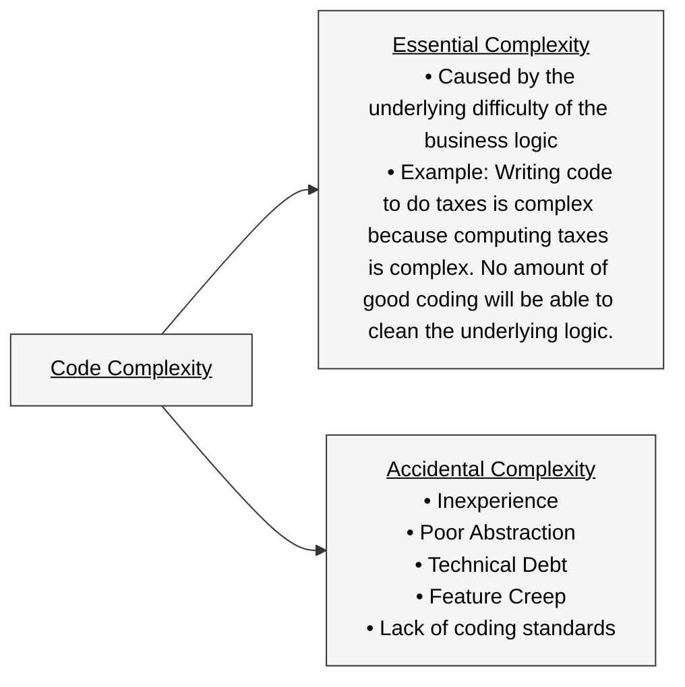

# Separation of Concerns/Abstraction

- Last time we talked about the DRY principle and how we can use it to write better code.
- Today we are going to talk about abstractions and separation of concerns
- Abstraction is phrase we use to _hide_ implementation details while capturing essential features required to use the program. When we drive a car the implementation details of how the engine works are hidden from us and abstracted away to a pedals and a steering wheel. 
- Separation of concerns is the concept of dividing a program into parts with specific well-defined functionality. 
- Breaking code into functions and modules that separate concerns effectively and present a consistent abstraction level is how we can write code that is easy to use not only for the writers but for other people working on the code base.
- The classic example of how to understand separation of concerns is to think about the process for how a restaurant works. In a restaurant there are roles that have specific, well-defined functions:
  - The Chef cooks
  - The waitstaff interface with the customers
  - The cleaners/dishwashers prep materials for reuse
- This is a clear "separation of concerns" -- waitstaff don't worry about dirty dishes, dishwashers do not worry about food preparation, etc. 
- We want the code that we write to have a similar well-defined structure.
- Today we are going to consider separation of concerns at the _file_ level, which is the most powerful method we have of delineating sections of code.
- Python, like a lot of other programming languages, leverages the file system (directories and files) to help us break code into pieces.
- Before starting to dig into our own examples, lets look at an example from Pandas:
  - [Link to Main Pandas Library](https://github.com/pandas-dev/pandas/tree/main)
  - [String Accessor Method](https://github.com/pandas-dev/pandas/blob/main/pandas/core/strings/accessor.py)
    - Look at the first function `forbid_nonstring_types`
    - Look at the line `def strip(self, to_strip=None)`
- What is the `strip` code doing?

  - Specific small functionality: Take a look at the function `def strip` in the function. What is it actually doing? 
  ```
      @forbid_nonstring_types(["bytes"])
      def strip(self, to_strip=None):
          result = self._data.array._str_strip(to_strip)
          return self._wrap_result(result)
  ```
    - The decorator `forbid_nonstring_types` we saw from the top of the file returns an error based on if the type isn't correct.
    - All this function does is _map_ the `strip` accessor function to the `_str_strip` function on `_data.array`. 
    - Think a lot about that: The only thing this function does is _map_. The implementation of strip is elsewhere. 
    - Why would this be done? By adding this level of abstraction between how the _user_ calls the function (such as `df['some_string_column'].str.strip()`) and where the work occurs we increase our ability to have multiple people work on this code as well as change the behavior of the strip function.
    - Since the functionality and map are separate we could conceivably change the strip behavior on the `str` accessor without changing the strip behavior on every other object that it gets called. This map abstracts the action away from the user so that it can potentially be rerouted.
    - This also means that we can have a single implementation of strip that is accessed from many different places -- so no code repetition (Preserving our DRY principle).

- Looking over the code we notice a few things that are different from the code that we write:
  1. Ratio of code to comments
  2. _Long_, not wide lines
  3. TONs of directories and files
  4. Layers of code calling each other
  5. Type Hints
   

## Code Complexity

- Why is the code structured like this? 
  
* Code-to-Comments: Pandas is a large library with tons of people working on it. Making sure that the underlying logic is represented as both code and in written form is an easy way to make the code more useful for contributors.
* Common-style-format: Having a common style (in this case PEP8) helps maintain consistency across the code base. For example, if teams use different styles for naming functions then making changes across the code base is much more difficult.
* Layers-of-Abstraction: By adding layers of abstraction that align with specific functionality we know where to put code and logic.
* Easier testing and verification.
* Smaller file are easier to work with and less likely to run into conflicts. Many coding style guides/auto-checking software have limits to the number of lines per file. [PyLint](https://pypi.org/project/pylint/) a popular static analysis tool will return an warning if there are more than 1,000 lines in a file.

- The overarching theme is that by writing code in this manner we reduce _code complexity_.
- What is code complexity? While there are many potential definitions, the one that makes the most sense to me is that code complexity is a measure of how difficult is it for an engineer to understand the code.


   
- The chart above shows a breakdown of the two major types of complexity. Importantly it is not possible to remove all complexity from a computer program, we want to make sure that we minimize it when appropriate. 

## Types of Accidental Complexity

### Inexperience

- The largest driver of code complexity is inexperience and lack of knowledge. For example, I do not do a lot of work with PyTorch which is a complex library that, while written in python, behaves very differentially than other common Python code. 
  - When I write code in PyTorch it appears rough because of this lack of experience.
- For students who are just getting started this is the largest source of complexity; the only way to get better is through work.

- For example, consider the following code (which is similar to code that I have seen from new engineers):


``` 
def process_data(data_list):
    temp_list = []
    for item in data_list:
        if item > 0:
            temp_list.append(item)
    
    result_list = []
    for item in temp_list:
        if item < 100:
            result_list.append(item)
    
    return result_list
```

And compare that to:

```
def process_data(data_list):
    return [2 * x for x in data if x > 0 and 2*x < 100]
```

Both pieces of code do the same thing: 
* Take all the numbers in a list and return 2x each, but only if they are positive and doubling them keeps it less than 100.

- The second uses a list comprehension with a small amount of logic to return the list. This is relatively easy to understand because you can cleanly break out that this is a map and filter on a list. 
- The first uses two for loops to implement the same thing in a way that is much more difficult to understand as the logic on the filter exists on two different lines. 

### Poor Abstraction

- A second common cause of code complexity for new engineers is poor abstractions. 
- A poor abstraction can take multiple forms, the most common I see is what I would term "uneven" where the interface has requires some specifics but not others. Consider the following piece of code:

```
def process_data(file_to_process, minimum_weight=50):

    df = pd.read_csv(file_to_process)
    map_df = pd.read_csv('/users/nick/map_file.csv')  

    merged_df = pd.merge(df, map_df, on=['loc_name'], how='inner')

    merged_df_drop_min_weight = merged_df.loc[(merged_df.weight > minimum_weight), :]

    final_df = merged_df_drop_min_weight.loc[(merged_df_drop_min_weight.distance < 125), :]

    return final_df
```

- This code demonstrates a poor abstraction for two reasons:
  - The code relies upon a hard coded path that cannot be changed.
  - The code has one magic number (125) inside in a manner that cannot be changed but has one magic number (50) as an argument.
- We could rewrite this and it would have a much more even level of abstraction in the arguments:

```
def process_data(file_to_process, map_file_to_process, minimum_weight=50, max_distance=125):

    df = pd.read_csv(file_to_process)
    map_df = pd.read_csv(map_file_to_process)  

    merged_df = pd.merge(df, map_df, on=['loc_name'], how='inner')

    merged_df_drop_min_weight = merged_df.loc[(merged_df.weight > minimum_weight), :]

    final_df = merged_df_drop_min_weight.loc[(merged_df_drop_min_weight.distance < max_distance), :]

    return final_df
```

- This file demonstrates a much more even level of abstraction.

### Technical Debt

Technical debt is a form of code complexity that occurs when speed is prioritized over writing clean code. When there is a time crunch it is difficult to carve out space to think tactically about the code and, in these situations, abstractions, concern separation and other hallmarks of good code are often ignored.

### Feature Creep

Like technical debt, feature creep is a function of not having enough time to build code in a tactical and strategic manner. Feature creep is when a something relatively small is added to a design (or function) beyond its original purpose. For example: you may have a function which is supposed to filter the data for weight and distance, but now we want to merge on another dataset. Rather than building a separate function to handle this, you squeeze in that merge into the current function. 

This type of feature creep weakens the strength of code and makes it much less reusable and useful.

### Lack of coding standards

Finally, code complexity is often increased by not following a common coding convention. 

There are many different coding styles. The two most frequently cited (that I've seen) are:

* [PEP8](https://peps.python.org/pep-0008/)
* [Google Coding Style Guide](https://google.github.io/styleguide/pyguide.html)

They have quite a bit of overlap but do have some divergences. 

Does the specific style guide matter? I'd argue that it is more important to have _a_ style guide than one in particular. Good developers are able to change their coding style and so it is more important to have one laid.


## SOC & Flask

- Today we are going to focus on taking a flask app and doing a separation of concerns exercise on it. 
- The example that we will be working on can be found in [this directory](../lecture_examples/08_soc/).
- The application that we are working on is going to server data, in an API format about NBA players. The data was downloaded from [here](https://www.kaggle.com/datasets/justinas/nba-players-data).
- We are going to create 3 API endpoints: 
  - One that lists all players for the 2022-23 season
  - One that lists all colleges attended for anyone who played in the 2022-23 season
  - One that lists all players, as a function of specific teams.
- We will start with the following `app.py` [file](../lecture_examples/08_soc/app.py) which contains most of our code. 

```
from flask import Flask, jsonify
import pandas as pd

app = Flask(__name__)


@app.route("/list_players", methods=["GET"])
def list_players_route():
    df = pd.read_csv("/app/src/all_seasons.csv")
    df = df.loc[
        (df.season == "2022-23"),
        ["player_name", "college", "team_abbreviation"],
    ]

    players_list = df["player_name"].unique().tolist()

    to_return = {"players": players_list}
    return jsonify(to_return), 200


@app.route("/list_colleges", methods=["GET"])
def list_colleges_route():
    df = pd.read_csv("/app/src/all_seasons.csv")
    df = df.loc[
        (df.season == "2022-23"),
        ["player_name", "college", "team_abbreviation"],
    ]

    df = df.loc[~(df.college.isna()), :]
    college_list = df["college"].unique().tolist()

    to_return = {"college": college_list}
    return jsonify(to_return), 200


@app.route("/colleges_team/<team>")
def list_colleges_per_team(team):
    df = pd.read_csv("/app/src/all_seasons.csv")
    df = df.loc[
        (df.season == "2022-23"),
        ["player_name", "college", "team_abbreviation"],
    ]

    if team not in df.loc[:, 'team_abbreviation'].unique():
        return jsonify({'Error': f'Team {team} does not exist'})

    list_of_players = (df
                       .loc[(df.team_abbreviation == team), 'player_name']
                       .to_list()
                       )

    to_return = {team: list_of_players}
    return jsonify(to_return), 200


@app.route("/players_team/<team>")
def list_players_per_team(team):
    df = pd.read_csv("/app/src/all_seasons.csv")
    df = df.loc[
        (df.season == "2022-23"),
        ["player_name", "college", "team_abbreviation"],
    ]

    if team not in df.loc[:, "team_abbreviation"].unique():
        return jsonify({"Error": f"Team {team} does not exist"}), 500

    list_of_players = df.loc[
        (df.team_abbreviation == team), "player_name"
    ].to_list()

    to_return = {team: list_of_players}
    return jsonify(to_return), 200


if __name__ == "__main__":
    app.run(debug=True, host="0.0.0.0", port=5000)

```

- First, look at the command `jsonify` this is a flask command that turns a dictionary object with the correct metadata to form a `Response` object. It handles the header `Content-Type` properly and adds the additional decoration to properly respond. 
  - When we use `jsonify` we use an _implicit tuple_ to include the status code on the response. (e.g. `jsonify(to_return), 200`). While no tuple is defined the object returned from this is a tuple.
  - I personally find this gross, but it is a common flask pattern.
- Second, look at `@app.route("/players_team/<team>")` and the resulting function call, which also specifies `team`. This type of route parameter allows us to accept _anything_ into the url and then pass that, through the route and into the function for processing.
  - In the code above we check to make sure that the `team` is inside the actual teams in the data and if it is not return a 500, otherwise we filter the data and return it as a JSON object.
- You can run this by typing `make run` in the directory.
- This code works, but is a single file with lots of boilerplate code.
- There is repetition and poorly defined logic locations (such as validation logic outside of a decorator function).

## Breaking up is hard to do

- You can see the final code after refactoring [here](../lecture_examples/08_soc_updated/).

- Before we break up this code we want to think a lot about what the code is doing. In this case the code is:
  - Serving routes
  - Filtering Data
  - Loading Data

- These tasks are pretty common for many applications and can be described a few different ways. I generally use "Three-Tier Architecture", but some people say "Three Layer" or "Model View Controller".

- In our case we will the following layers:
  - Route / Presentation Layer: This the external facing code that handles the interface to the user
  - Business Logic / Application Layer: This where the "thinking" goes, sometimes call the business logic.
  - Data / Persistence layer: This is the layer that touches the data.

- We will also do an abstraction around the api to break it up among different components. Specifically we have three different endpoints that focus on three different concepts, so we will break this up into three different files. 

- We will also break up our route definitions in a way that breaks up the flask route registration (e.g. defining a route) and the functions which handle the routing. Lets take a look at the final directory structure and a few of the files:


```
.
├── app
│   ├── __init__.py
│   ├── api
│   │   ├── __init__.py
│   │   ├── colleges
│   │   │   ├── __init__.py
│   │   │   └── routes.py
│   │   ├── players
│   │   │   ├── __init__.py
│   │   │   └── routes.py
│   │   └── teams
│   │       ├── __init__.py
│   │       └── routes.py
│   ├── data_utils
│   │   ├── __init__.ppy
│   │   └── loading_utils.py
│   └── route_utils
│       ├── __init__.py
│       └── decorators.py
├── app.py
├── data
│   └── all_seasons.csv
├── Dockerfile
├── Makefile
└── requirements.txt
```

There are two files I want to look at to show the effect of this refactoring. First we'll start with our `app.py` file:

```
from flask import Flask
from app.api.players.routes import register_player_routes
from app.api.teams.routes import register_team_routes
from app.api.colleges.routes import register_college_routes


def create_app():
    app = Flask(__name__)
    register_player_routes(app)
    register_team_routes(app)
    register_college_routes(app)
    return app


app = create_app()

if __name__ == '__main__':
    app.run(host='0.0.0.0', port=5000, debug=True)
```

- After refactoring we can see that this file has a consistent abstraction level. It contains configuration information about the flask app and does only a few specific actions -- it registers routes and starts the app. 
- While there are ways that we could improve this, such as pulling the parameters from the `app.run` command into a separate files, given that they are unlikely to change that level of abstraction is probably unnecessary.


- The other file I want to look at is `/app/api/colleges/routes.py`, which we can find below.

```
from flask import jsonify
from app.data_utils.loading_utils import load_data
from app.route_utils.decorators import validate_team

BASE_URL = '/api/teams'


@validate_team
def list_players_per_team(team):
    df = load_data()

    list_of_players = (df
                       .loc[(df.team_abbreviation == team)
                            & ~(df.college.isna()), 'player_name']
                       .to_list()
                       )

    to_return = {team: list_of_players}
    return jsonify(to_return), 200


def register_team_routes(app):
    @app.route(f'{BASE_URL}/players/<team>/list', methods=['GET'])
    def list_players_per_team_route(team):
        return list_players_per_team(team)

```

- There are a few important things to notice:
  
  1. Use and import of the decorator to handle validation of team name (DRY Principle).
  2. Use of a `register_college_routes` function and global `BASE_URL` to specify a single location to base everything off of. Since the `BASE_URL` applies to everything in this file and is important for readability it is generally okay to use it as a global.
  3. We moved the loading data command to a single function, rather than have the read csv in all files.

- While there are additional ways that we can make this better and more abstracted this is probably a good enough level. There is very little code repetition and, another hallmark of well structured code, the imports required for each file are boxed in:
  - Our `loading_utils.py` file only requires pandas which makes sense given it loads the data.
  - Our `app.py` file only requires loading the route loading functions and the flask app itself. It does not require importing either pandas or any of the request / response logic of flask!
  - All of our `routes.py` files only import a return objects (`jsonify`) and other functions which interact directly with the data; there is no dependency on `pandas` in these files.
- Analyzing imports is not a perfect way to determine separation of concerns, but it is often a leading indicator of when things are going awry.