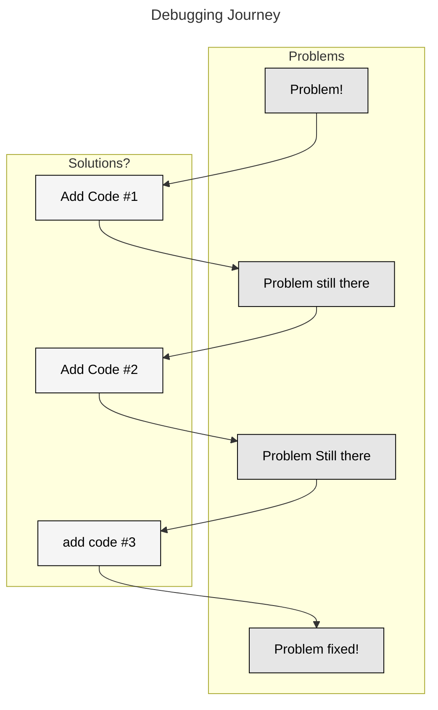

# Static Analysis & Code issues

In today's lecture we will go over a few things that I have noticed in the code when reviewing the projects and quizzes. These will be presented as a laundry list of observations that should be cleaned up.

## Observation #1: Building on vs. refactoring

- When submitting the project you should make sure that you go through the entire code base to verify that it is a cohesive whole that aligns with the project specifications.
- Multiple groups had errant files, poor file names (e.g. flask code called `eda_2019.py`) and library files with entrypoints.
- There were also files in locations that didn't make sense (such as code in `data` directories, etc.).
- Also, code from previous parts was frequently lying about in inaccessible ways. 
- At the point where you submit the commit hash to canvas the code base should be a self-contained cohesive whole.

## Observation #2: Not being organized at the line level

- Multiple code bases had pieces of code that were didn't have logical consistency inside the code blocks.
- For example, there were Makefiles that had

```
VAR1=123
.PHONY=build run
VAR2=abc
```

Hiding the phone in the middle makes it difficult to find! Better organization would be:

```
VAR1=123
VAR2=abc

.PHONY=build run
```

By adding the space and breaking up the sections according to their function the code is easier to read and comprehend.

- This was also found in the Python code where different code functions would be mixed together, such as in the example below where a variable is set between two functions, making it much more difficult to find. Putting it _before_ the function definitions is a better strategy.

```
def func1():
    ...

def func2():
    ...
  
some_global_var=123

def func3():
    ...

def func4():
    ...
```

- The important take-away is that the structure of your code should not hide the functionality, but instead make it easy to read and work with.


## Observation #3: Flow Control Consistency

- Consider the code below, which is taken from [Quiz 3](../quiz/quiz3A.tex)

```

@app.route('/api/v1/status', methods=['GET'])
def api_status():
    status_code = api_status_code()

    if status_code == 0:
        return Response(status=500)
    elif status_code == 1:
        return Response(status=200)
    elif status_code == 2:
        return Response(status=503)

    return None

```

Lets focus on the inside blow. Multiple people wrote code that looked like:


```
if status_code == 0:
    return Response(status=500)

if status_code == 1:
    return Response(status=200)
else status_code == 2:
    return Response(status=503)
```

or

```
if status_code == 0:
    return Response(status=500)
elif status_code == 1:
    return Response(status=200)

if status_code == 2:
    return Response(status=503)
```

Given that `status_code` is equal to 0, 1 or 2 then all of the above are functionally equivalent. However, in the last two cases the logic is broken up in an inconsistent manner. 

There are multiple ways for this code to be written. For example, below is also a response that is consistent internally:

```
if status_code == 0:
    return Response(status=500)

if status_code == 1:
    return Response(status=200)

if status_code == 2:
    return Response(status=503)

```

Mixing the logic however is a bad idea as it implies that the code connects in a way that it does not.

- Note that in the above the question was not clear about what to do in the case that `status_code` is not in the response set. In some of these the function would return `None` while in others it may return the last value in the clause.


## Observation #4: Multiple Definitions

- There were examples of multiple definitions in code wherein variables were defined in multiple redundant manners. 
- This does not create easy to debug code because it may require multiple changes to impact the code.
- For example there were groups that defined environment variables in the same way multiple times -- both in the Dockerfile as well in as the Makefile.
- Another example of this would be python code that looks like the following:


```

API_KEY = os.environ['DATA-241-API-KEY']

def func():
    api_key = os.environ['DATA-241-API-KEY'] 
    ...

```

In this code the same functionality (extracting the API Key) is repeated in two places, once of which has access to the original definition. 

- This is not only a violation of the DRY principle, but also very difficult to debug.


## Observation #5: Unnecessary code LLM / Stack overflow

- There were multiple examples of what was probably debugging or LLM caused detritus. 
- Before stating that something is complete you need to make sure that you know every line of code and what it does and, specifically, making sure that it is necessary for the function.

- There were two big examples of this in the submitted code. First I saw a lot of `EXPOSE` in Dockerfiles. This command does not do anything and given we didn't use it in class I suspect it was placed in the file because there was an issue with the ports. `EXPOSE` was used more frequently in the past, but is not used as much now.

- (I think) that a lot of beginners code by trying something and then when they aren't sure where to proceed they google (or chatgpt) the answer and then followint he



- In the above process only a subset of the code was required and thus the person doing the coding _unless they remove the extraneous code_ will have likely increased the complexity of their code.

- **Before thinking a problem is complete make sure you understand why the solution works and remove unnecessary code!**

- In the case of the Dockerfile and `EXPOSE` it was most likely a port issue that the was trying to be fixed. The `EXPOSE` was added, it did nothing, but was never removed. 

- Another example of this is that I saw a number of students had `?=` in their makefile rather than `=`. The first of these commands `?=` does something different (and not what we want) than a simple assignment operator. 

| Grading Note | 
| --- | 
| Any unnecessary code in your code base will now result in a grading penalty. It's _fine_ to use LLMs and stack overflow, but make sure that you know what is being done. | 

## Linting and Static Analysis

- One way to help us identify some of these issues is via static analysis. Static analysis the process of analyzing code _without running it_ for the purpose of identifying features of that code.

- What these tools do is take the code base (like an input to a function) and then run code on it which identifies specific issues.

- There are a bunch of different things that static analysis tools can analyze. Examples include:

  - Code quality:
    - Complexity measures can be calculated on code to understand how difficult it is to understand
  - Bug Fingers:
    - Identify common issues of code that does not execute as expected. Examples include unreachable branches or unused variables.
  - Security Analysis:
    - Look for packages and actions inside a code base that present a security risk.
  - Type Checkers:
    - Go through code and enforce typing on variables, identify input and output mismatch.
  - Performance Analysis:
    - Are there places in the code which do not perform as expected.
  - Linters / Style / Code Convention Enforcers:
    - Make sure that the code conforms (stylistically) to specific systems and expectations.

- We will focus on (what are probably) the most common tools for static analysis in python which include [Black](https://github.com/psf/black), [PyFlakes](https://pypi.org/project/pyflakes/) and [iSort](https://pycqa.github.io/isort/).

- Each of these tools enforces different coding standards and style requirements. 

- Previously one would have to install each of these tools and run them individually. Lucky for us, however, a single tool can now control all of them: [ruff](https://github.com/astral-sh/ruff). This is python static analysis tool written in the rust programming language.

- While Ruff is frequently celebrated for its speed, it's biggest contribution IMO is centralizing all of these tools into a single configuration file. 

- Ruff can be installed via pip: `pip install ruff` onto your host machine.

- Ruff is controlled via a file called `pyproject.toml` 
  - [`toml`](https://en.wikipedia.org/wiki/TOML) files are a file format frequently used for configuration information. 
  - For this class we will use the one [here](../project_assignments/pyproject.toml)

- If you look at the configuration file you will see that the format of checks begin with a letter and then have a number. For example, the check `D104` checks to make sure that there is dock string at the module level. You can find definitions for all checks and why they are important [on this page](https://docs.astral.sh/ruff/rules/).

- There are two important commands when you use ruff: `ruff check .` (`ruff check . --fix`) and `ruff format .` (`ruff format . --diff`).

- `ruff check .` Checks files for errors as specified in the `pyproject.toml` file. If you add the argument `ruff check . --fix` it will also fix many types of issues. Note that the code fixing it does is non-destructive, you do not need to worry about it changing the logic of your code.

- `ruff format .` On the other hand runs the code through more stylistically focused checks. While there are some checks that overlap, in general you can think of `ruff format` as focusing on style and `ruff check` as focusing on deeper issues.

- Note that `ruff format .` does _not_ have a `--fix` option -- This is because it will automatically fix! Before running it I recommend running `ruff format . --diff` which will print the changes that it would make. After perusing you can run the `ruff format .` command make the changes.

- One thing to keep in mind is that we often install ruff not inside a docker container but on the host machine. There are some intricacies around running it inside a docker container with the technology we will discuss next, so rather than deal with that many developers just run `ruff` on the host machine directly without using a more complex environment.

| Grading Note | 
| --- | 
| For this class all code submissions need to pass the [pyproject.toml](../project_assignments/pyproject.toml) specification here for both `ruff format` and `ruff check`. If your code does not pass at 100% your submission will be docked points |

## Pre-commit hooks

- Using static analysis is great, but it requires the developer to remember to run it before they commit their code.
- One way of getting developers to do this is to use _pre-commit hook_.
- Pre-commit is a python library (installed via `pip`) which hooks into git on the host machine and integrates with `git` to allow for more complex operations around other git operations.
- For example, we will use a pre-commit hook to run `ruff` whenever a user tries to commit a file. If the code does not pass our requirements then the commit is not allowed to complete and the user will have to fix it before continuing.
- The pre-commit hook is controlled by a hidden file called `.pre-commit-config.yaml`. The one we will use for this class can be found [here](../project_assignments/pre-commit-config.yaml). **Note that this file is NOT named properly and should start with a "`.`" when you put it in your repository.**
- If you look at this [`yaml`](https://yaml.org/) file you will see that it runs two commands `ruff` and `ruff format`, both of which are defined in the `ruff-pre-commit` library linked in the `repo` line. 
- These do what you would expect -- the first executes `ruff check` and the second runs `ruff format`. 
- To install the Pre commit hook you need to do the following:
  1. Put the file `.pre-commit-config.yaml` into the root of your repository
  2. Install pre-commit by typing `pip install pre-commit`
  3. Install this configuration by typing `pre-commit install`
- At this stage your pre-commit hook is installed and you will not be able to commit code that does not pass this hurdle.

- If you want to run the pre-commit on all files in your repo the command `pre-commit run --all-files` will come in handy. This will run whatever your pre commit hook is against all the files in your repo. A very useful command.
