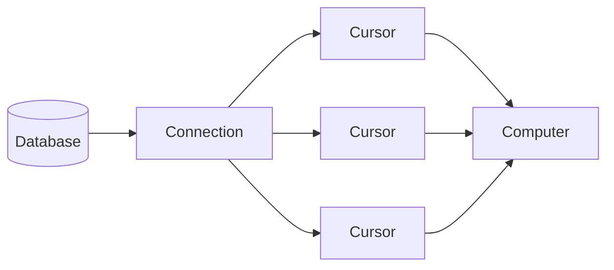

# Connecting Python to a Relational Database

## What is a relational database? 

- Relational Databases are powerful, scalable systems for holding data based that conform to the rules set up [by Edgar Codd](https://en.wikipedia.org/wiki/Codd%27s_12_rules). 
- We use SQL, a [declarative language](https://en.wikipedia.org/wiki/Declarative_programming) to access data within a Relational Database.
- There are many variants of SQL servers:
  - Oracle
  - Postgres
  - MySQL
  - MariaDB
  - MS-SQL
  - SQLite
  - Others...
- Relational Databases have a set of common properties:

  1. Use SQL
  2. Store data in a relational model (think rows, columns and tables)
  3. Have a set of rules about how data is processed in the DB (transactions) which have a set of nice properties:
        - (A) Atomic: There are no half-completed transactions. Work is either done or not done.
        - (C) Consistent: All work is consistent in that the database is always in a valid state. Examples of this failing could be having a string in an int field.
        - (I) Isolation: The database allows for multiple streams of work (such as multiple users)  in a manner that prevents them from interfering with each other.
        - (D) Durability: All changes and updates to a system, once completed, remain completed even in the event of system failures.

- These properties are what are generally considered the hallmarks of a Relational Database System. 
- On an aside, a moniker thrown in database systems is "NoSQL" which is not necessarily a rejection of SQL but typically refers to database systems that may sacrifice some of the above properties in exchange for other benefits like scalability, flexibility, or performance.
- Why would we do this? 
  - Maintaining all of the above is costly and can sometimes be slow.
  - If we are comfortable with making sacrifices of the above we can often build faster and cheaper systems (at a cost)
  - For example: If we are facebook and we have a database table which tracks the number of likes a post receives than we may be okay with the actual count being occasionally off by a small amount if it saves us lots of money. OTOH, if we are a bank and our table tracks account balances than we are _not_ willing to make such as trade-off.
- What is important is that when we use NoSQL Databases we know what trade-off we are making, otherwise we could end up with a system which doesn't satisfy our needs.
- In this class we are going to use [SQLite](https://www.sqlite.org/) which is a lightweight and designed for small scale application. 

## SQLite

- SQLite is a file-based database. Basically there is a single file that contains the entire database. SQLite leverages file operations in order maintain ACID compatibility. 
- [SQLite3](https://docs.python.org/3/library/sqlite3.html) is bundled with Python, so we do _not_ need to pip install anything.
- However, there are hooks into the operating system that we do need to install in order to use this product. 
- In our Dockerfile we can add:

```
RUN apt-get update 
RUN apt-get install -y sqlite3
```

which will install the program. The command `apt-get` is a command line tool for managing packages in Unix-y environments (specifically Debian-based systems such as Ubuntu). You can think of it as similar to `brew` on macs. 


#### Running SQLite at the command line

- Once the program is installed we can run this on the command line. Start with running `make inter` (e.g. enter an interactive session) and then type in, at the resulting command line `sqlite3` to star the session.
- To exit an interactive session we use `.q`. Commands inside the `sqlite3` interactive session begin with a `.`
- If we type `sqlite3 test.db` this will connect to file called `test.db` which will store the databases's data. While there is no forced file extension, we common use `.db`, `.sqlite`, `.sqlite3` or `.db3` as file extensions for sqlite3 files.
- Note that until you make a change (such as creating a table), the file is not created. 

## Connecting databases to Python

- The diagram below demonstrates the common connection-cursor abstraction used by programming languages to connect to databases. 
- In python this manifests itself in a `connection` which contains sql server specific components and `cursor` method



## Using SQLite 

- Refer to the notebook [here](../lecture_examples/10_pipeline_1/notebooks/lect11.ipynb) for specifics of what was covered in class.
- To use sqlite3 in Python we import it and then set up a connection:
```
import sqlite3
conn = sqlite3.connect(file_name_of_db)
```

- As stated above we will have multiple cursors attached to each connection. Unlike connections which are specific to the variant of SQL, cursors are more general and universal. You can expect to have the following functions available to you on any cursor:

| method | what it does | 
| --- | --- | 
| `.execute` | Runs a query | 
| `.executemany` | Runs multiple queries | 
| `.fetchall` | Get all results returned from a query | 
| `.fetchone` | Return a single result from a query | 
| `.fetchmany` | Return some specific results from a query | 

- As an example consider creating a table and then inserting data as below:

```
create_table_query = """create table cls (bname text, bage int); """
cursor.execute( create_table_query )

insert_data_query = """
INSERT INTO cls (bname, bage) VALUES 
    ('John Smith', 28),
    ('Sarah Johnson', 34),
    ('Michael Lee', 42),
    ('Emma Wilson', 25),
    ('David Brown', 31)
;"""

cursor.execute(insert_data_query)
conn.commit()
```

- **Important Note:** the command `conn.commit()` appears in this example. We need to run `commit()` on the _connection_ every time we modify the database. In this case we are both creating a table and inserting data. If we do not run the commit then the changes may not stick and, upon exiting the session we may lose the data.

- Once we have run the commands above we can verify that the data is in the tables:

```
cursor.execute("select bage, bname from cls;")
data = cursor.fetchall()
print(data)
```

which will return all of the data in our table.

- Note that the above does _not_ have the names from the columns it only returns the data as a list of tuples. If we want to get the column names we need to look at the `cursor.description`. For, after running the above we can then execute:
```
print(cursor.description)
```

which will print:
```
(('bage', None, None, None, None, None, None), ('bname', None, None, None, None, None, None))
```
which is a tuple of tuples. For the purposes of this class we are only interested in the first item in each of the nested tuples which is the column name of the returned data. We can leverage this to create a function which returns a list of dictionaries containing the information from our query. 

```
def execute_query_return_list_of_dicts(conn, sql_query):

    cursor = conn.cursor()
    cursor.execute(sql_query)
    description_info = cursor.description
    
    headers = [x[0] for x in description_info]
    query_result = cursor.fetchall()
    
    return_dict_list = []
    
    for result in query_result:
        single_result_dict = {headers[i] : result[i] for i in range(len(headers))}
    
        return_dict_list.append( single_result_dict )
    return return_dict_list

```

The code above takes in two arguments, a connection and an sql query. What it does is then execute the query, grab all the data, using `fetchall` and then turn it into a list of dictionaries where each dictionary contains the data from a row in the table. For example:

```
execute_query_return_list_of_dicts( conn, "select * from cls;")

[{'bname': 'John Smith', 'bage': 28},
 {'bname': 'Sarah Johnson', 'bage': 34},
 {'bname': 'Michael Lee', 'bage': 42},
 {'bname': 'Emma Wilson', 'bage': 25},
 {'bname': 'David Brown', 'bage': 31},
]
```

## Lower memory list of dicts

- The code above generates two copies of the data from the table in memory: one in the `fetchall` command and one in the `return_dict_list`. 
- For larger queries this will use quite a bit of memory. We can avoid some of that memory usage by instead of using `fetchall` we use `fetchone`, which grabs rows one-by-one. 
- Rewriting our function:

```
def execute_query_return_list_of_dicts_lm( conn, sql_query):
    """
    Low memory version of pvs command
    """

    cursor = conn.cursor()
    cursor.execute(sql_query)
    description_info = cursor.description
    
    headers = [x[0] for x in description_info]
    return_dict_list = []

    while True:
        single_result = cursor.fetchone()

        if not single_result:
            break

        single_result_dict = {headers[i] : result[i] for i in range(len(headers))}
        return_dict_list.append( single_result_dict )

    return return_dict_list

```

- In this example we have changed how the returned data is put into our final object. Rather than grabbing all the data at once we grab it row-by-row, thus decreasing the total memory usage. 
- `fetchone` will return a row until it runs out of rows at which point it will return `None`, the line `if not single_result` will then catch and break out of the while loop

## Execute Many for inserts

- The last commonly used cursor command is `executemany` which has a slight different syntax than what we have used in the past because it relies upon _parametrized queries_ which are strings that have placeholders for inserting data.
- These types of queries are used because they help avoid [sql injection attacks](https://en.wikipedia.org/wiki/SQL_injection).
- The way they work is that you separate the data that is changing from the query that is executing on the data and put markers inside the query to denote what values are changed.
- Consider the following example:
```
new_names = ['a', 'b', 'c', 'd', 'e']
new_ages  = [1, 2, 3, 4, 5]
data_to_insert = list(zip(names, ages))

query_str = "insert into cls (bname, bage) values (?, ?);"

cursor.executemany(insert_query_string, data_to_insert)
```

- This code works by substituting the data from data_to_insert, tuple by tuple into the query. It is equivalent to running the following sql command.

```
insert into cls (bname, bage) values (a, 1);
insert into cls (bname, bage) values (b, 2);
insert into cls (bname, bage) values (c, 3);
insert into cls (bname, bage) values (d, 4);
insert into cls (bname, bage) values (e, 5);
```

- When we want to insert data we can use the `executemany` command to handle the insert, which is a fairly common practice for small to medium sized data.

## Indexes (or how to make things fast)

- An idex is a data structure which trades space for speed. 
  - It does this by creating a secondary physical representation of the data set up in a way to facilitate looking for data.
- Indexes are specific to columns or sets of columns and they can be very complex structures. 
- These structures are also dependent on the SQL variant that are you using. The available options for an index are different if you are using Postgres vs. using Sqlite. 
- The basic create index command looks like:
```
create index {index_name} on {table_name} ({list_of_columns_to_index}).
```

For example if we wanted to create an index on our `cls` table on the `age` column we could do something like:

```
create index idx_cls_bage on cls (bage);
```

- Note that queries are only used if the database query optimizer (which decides how the query is run) believes that the index will make the query run faster. There are many times when adding an index will not make things faster because the query optimizer will not use it, instead choosing a different method of completing execution of the query.

- You can have indexes on multiple columns on a table and you can create indexes on groups of columns, such as:

```
create index idx_cls_bage_bname on cls (bage, bname);
```

- The index here would increase the performance of joint lookups of both `bage` and `bname`

- **Note: For the project I would recommend creating an index on the year and symbol.**
