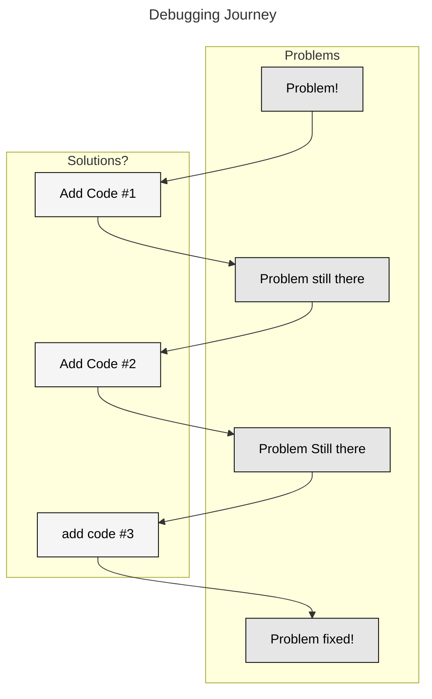

<!---
title: "Static Analysis & Code Issues"
--->

## Part 1: Linting and Static Analysis

- One way to help us identify some of these issues is via static analysis. Static analysis the process of analyzing code _without running it_ for the purpose of identifying features of that code.

- What these tools do is take the code base (like an input to a function) and then run code on it which identifies specific issues.

- There are a bunch of different things that static analysis tools can analyze. Examples include:

  - Code quality:
    - Complexity measures can be calculated on code to understand how difficult it is to understand
  - Bug Finders:
    - Identify common issues of code that does not execute as expected. Examples include unreachable branches or unused variables.
  - Security Analysis:
    - Look for packages and actions inside a code base that present a security risk.
  - Type Checkers:
    - Go through code and enforce typing on variables, identify input and output mismatch.
  - Performance Analysis:
    - Are there places in the code which do not perform as expected.
  - Linters / Style / Code Convention Enforcers:
    - Make sure that the code conforms (stylistically) to specific systems and expectations.

- We will focus on (what are probably) the most common tools for static analysis in Python, which include [Black](https://github.com/psf/black), [Pyflakes](https://pypi.org/project/pyflakes/), and [isort](https://pycqa.github.io/isort/).

- Each of these tools enforces different coding standards and style requirements. 

- Previously, one would have to install each of these tools and run them individually. Luckily for us, however, a single tool can now control all of them: [Ruff](https://github.com/astral-sh/ruff). This is a Python static analysis tool written in the Rust programming language.

- While Ruff is frequently celebrated for its speed, its biggest contribution, in my opinion, is centralizing all of these tools into a single configuration file.

- Ruff can be installed via pip onto your _host_ machine: `pip install ruff`. Or if you want to use _uv_ on your host machine `uv pip install ruff`.

- Ruff is controlled via a file called `pyproject.toml` 
  - [`toml`](https://en.wikipedia.org/wiki/TOML) files are a file format frequently used for configuration information. 
  - For this class we will use the one [here](../project_assignments/pyproject.toml)

- If you look at the configuration file you will see that the format of checks begins with a letter and then has a number. For example, the check `D104` ensures that there is a docstring at the module level. You can find definitions for all checks and why they are important on the Ruff docs page.

- There are two important commands when you use ruff: `ruff check .` (`ruff check . --fix`) and `ruff format .` (`ruff format . --diff`).

- `ruff check .` Checks files for errors as specified in the `pyproject.toml` file. If you add the argument `ruff check . --fix` it will also fix many types of issues. Note that the code fixing it does is non-destructive, you do not need to worry about it changing the logic of your code.

- `ruff format .` On the other hand runs the code through more stylistically focused checks. While there are some checks that overlap, in general you can think of `ruff format` as focusing on style and `ruff check` as focusing on deeper issues.

- Note that `ruff format .` does _not_ have a `--fix` option -- This is because it will automatically fix! Before running it I recommend running `ruff format . --diff` which will print the changes that it would make. After perusing you can run the `ruff format .` command make the changes.

- One thing to keep in mind is that we often install ruff not inside a docker container but on the host machine. There are some intricacies around running it inside a docker container with the technology we will discuss next, so rather than deal with that many developers just run `ruff` on the host machine directly without using a more complex environment.

| Grading Note | 
| --- | 
| For this class all code submissions need to pass the [pyproject.toml](../project_assignments/pyproject.toml) specification here for both `ruff format` and `ruff check`. If your code does not pass at 100% your submission will be docked points |

### Pre-commit hooks

- Using static analysis is great, but it requires the developer to remember to run it before they commit their code.
- One way of getting developers to do this is to use _pre-commit hook_.
- Pre-commit is a python library (installed via `pip`) which hooks into git on the host machine and integrates with `git` to allow for more complex operations around other git operations.
- For example, we will use a pre-commit hook to run `ruff` whenever a user tries to commit a file. If the code does not pass our requirements then the commit is not allowed to complete and the user will have to fix it before continuing.
- The pre-commit hook is controlled by a hidden file called `.pre-commit-config.yaml`. The one we will use for this class can be found [here](../project_assignments/pre-commit-config.yaml). **Note that this file is NOT named properly and should start with a "`.`" when you put it in your repository.**
- If you look at this [`yaml`](https://yaml.org/) file you will see that it runs two commands `ruff` and `ruff format`, both of which are defined in the `ruff-pre-commit` library linked in the `repo` line. 
- These do what you would expect -- the first executes `ruff check` and the second runs `ruff format`. 
- To install the Pre commit hook you need to do the following:
  1. Put the file `.pre-commit-config.yaml` into the root of your repository
  2. Install pre-commit by typing `pip install pre-commit`
  3. Install this configuration by typing `pre-commit install`
- At this stage your pre-commit hook is installed and you will not be able to commit code that does not pass this hurdle.

- If you want to run the pre-commit on all files in your repo the command `pre-commit run --all-files` will come in handy. This will run whatever your pre commit hook is against all the files in your repo. A very useful command.

## Part 3: More CRUD

### Expected Data

- In our previous lectures we defined the parts of an HTTP request and specifically mentioned a few places where we could pass data:

1. Through the URL directly:
   1. Either the URL itself (path parameter, URL parameter)
   2. Query parameters
2. Through the body of the request (as we do in POST requests)
3. Through the header of the request (as we do with our authentication)

- When running an API we try to be consistent around what data paths are used for different request types. This makes our API easier to understand and debug. 
- While I've seen APIs do a lot of things, the following table shows some general rules around which data types should be used for which request type. 
- Much of the below is historical and revolves around how we develop our abstractions between our data and code.
- While there are examples of APIs that stray from the below, this is a pretty common starting point.


| Request Type | Usual Data Types |
| --- | --- |
| POST | <ul><li>**Body**: Complete new resource data</li><li>**Headers**: Authentication tokens</li><li>**Headers**: Content-Type specification (usually JSON)</li></ul> |
| GET | <ul><li>**URL**: Resource IDs</li><li>**Query**: Filtering/pagination parameters</li><li>**Headers**: Authentication tokens</li><li>**Body**: Generally none</li></ul> |
| PUT/PATCH | <ul><li>**URL**: Resource ID</li><li>**Body**: Updated fields (complete resource for PUT, partial for PATCH)</li><li>**Headers**: Authentication tokens</li><li>**Headers**: Content-Type specification</li></ul> |
| DELETE | <ul><li>**URL**: Resource ID</li><li>**Headers**: Authentication tokens</li><li>**Body**: Generally none</li><li>**Query**: Sometimes used for bulk operations</li></ul> |

### Accessing each data type

- When we use Flask we access each data type differently. When using Flask there are a few access patterns for each that we should know:

| Data object | Example | Accessor | Description | 
| --- | --- | --- | --- | 
| Query Parameters | `https://www.google.com/search?q=uchicago` | `request.args` | This returns a dictionary-like object. To convert it to an actual dictionary you can use `request.args.to_dict`, though if there are multiply defined query parameters you will lose them. |
| URL Parameters | `https://github.com/NickRoss` | `https://github.com/<string:username>` | The parameter is then passed to the function inside the route handler. | 
| Body | Usually a JSON object | In Flask there are accessor methods on the request that are specific to the data type. For JSON we can use either `request.get_json` or `request.json`. | We use different methods depending on the context (e.g., uploading a file vs. simply sending some JSON data). There are lots of different ways to handle these things. | 
| Headers | Similar to the body, it is usually described as a dictionary-like object | `request.headers` is a dictionary-like object for accessing the headers. | This is not a dictionary and there are some important differences. Headers are not case-sensitive, for example. |

### Multiple request types 

- Flask allows us to easily track the request types and check for different data types in each. 
- One thing to keep in mind as you work through your own code is that it is very easy to violate the DRY principle when writing boilerplate code for routes abstraction.
- In the case of using multiple methods at a single endpoint there are a number of different methods for doing it, the key, like all code that we try to write is to keep it simple and consistent.

- Using the example from an updated version of our basketball Flask app, let's take a look at how to do this:

```python
from flask import jsonify, request

from app.data_utils.loading_utils import add_player, delete_player, load_data

BASE_URL = "/api/players"


def list_players_route():
    try:
        df = load_data()
        players_list = (df.loc[:, ["id", "player_name"]]
                        .drop_duplicates()
                        .to_dict("records")
                        )
        return jsonify({"players": players_list}), 200

    except Exception as e:
        return jsonify({"error": f"An error occurred: {str(e)}"}), 500


def delete_player_route(player_id):
    try:
        player_name = delete_player(player_id)
        return jsonify({
            "message": f"Deleted player: {player_name}",
            "id": player_id
        }), 204
    except Exception as e:
        return jsonify({"error": f"An error occurred: {str(e)}"}), 500


def add_player_route():
    try:
        data = request.get_json()

        # Validate required fields
        if not data.get("player_name"):
            return jsonify({"error": "player_name is required"}), 400
        if not data.get("team"):
            return jsonify({"error": "team is required"}), 400

        # Add player with optional college
        add_player(
            data
        )

        return jsonify({
            "message": f"Successfully added player: {data['player_name']}",
            "player": {
                "name": data["player_name"],
                "team": data["team"],
                "college": data.get("college")
            }
        }), 201

    except Exception as e:
        return jsonify({"error": f"An error occurred: {str(e)}"}), 500


def get_player_info_route(player_id):
    try:
        df = load_data()
        players_list = (df.loc[(df.loc[:, "id"] == player_id), :]
                        .to_dict("records")
                        )
        assert len(players_list) == 1
        return jsonify(players_list[0]), 200

    except Exception as e:
        return jsonify({"error": f"An error occurred: {str(e)}"}), 500


def register_player_routes(app):
    @app.route(f"{BASE_URL}", methods=["GET"])
    def list_route():
        return list_players_route()

    @app.route(f"{BASE_URL}", methods=["POST"])
    def add_route():
        return add_player_route()

    @app.route(f"{BASE_URL}/<int:player_id>", methods=["DELETE"])
    def delete_route(player_id):
        return delete_player_route(player_id)

    @app.route(f"{BASE_URL}/<int:player_id>", methods=["GET"])
    def get_player_info(player_id):
        return get_player_info_route(player_id)
```

- Lets start from the _bottom_ and work our way through the code.
- In the `register_player_routes` function we have four functions, each one corresponding to a single route-request type combination. Each route function has a simple call and response.
- This is well organized and keeps a consistent abstraction level. 
- This is not the only way that we could have broken up the routes. We could, instead choose a different abstraction layer but forcing the decision point of the request further down. For example:

```python
def register_player_routes(app):
    @app.route(f"{BASE_URL}", methods=["GET", "POST"])
    def base_routes():
        if request.method == 'GET':
            return list_players_route()

        if request.method == 'POST':
            return add_player_route()


    @app.route(f"{BASE_URL}/<int:player_id>", methods=["GET", "DELETE"])
    def base_player_route():
        if request.method == 'DELETE':
            return delete_player_route(player_id)

        if request.method == 'GET':
            return get_player_info_route(player_id)
```

- Looking at the methods above they functionally do the same thing, but they change where in the code the branching occurs for the method. 
- Is one better than the other? I'd make a slight argument that the first version is better, but both abstractions could be reasonably argued.
- The most important factor is that this abstraction is kept across the entire code base.

# Code Quality Issues

In today's lecture we will go over common code quality issues that have been observed in project submissions, and then introduce static analysis tools that can help catch many of these problems automatically.

## Part 1: Code Quality Issues

After reviewing assignments, quizzes, and projects, several recurring issues have emerged. These issues make code harder to read, maintain, and debug. Below are the most common problems:

### Issue #1: Repository Organization and Hygiene

- When submitting the project you should make sure that you go through the entire code base to verify that it is a cohesive whole that aligns with the project specifications.
- Multiple groups had errant files, poor file names (e.g. flask code called `eda_2019.py`) and library files with entrypoints.
- There were also files in locations that didn't make sense (such as code in `data` directories, etc.).
- Also, code from previous parts was frequently lying about in inaccessible ways or just commented out. 
- Not using `.gitignore`: `pycache`, `.DS_Store` files
- At the point where you submit the commit hash to canvas the code base should be a self-contained cohesive and final whole.

### Issue #2: Line-level Organization

- Multiple code bases had pieces of code that were didn't have logical consistency inside the code blocks.
- For example, there were Makefiles that had

```makefile
VAR1=123
.PHONY=build run
VAR2=abc
```

Hiding the phone in the middle makes it difficult to find! Better organization would be:

```makefile
VAR1=123
VAR2=abc

.PHONY=build run
```

By adding the space and breaking up the sections according to their function the code is easier to read and comprehend.

- This was also found in the Python code where different code functions would be mixed together, such as in the example below where a variable is set between two functions, making it much more difficult to find. Putting it _before_ the function definitions is a better strategy.

```python
def func1():
    ...

def func2():
    ...
  
some_global_var=123

def func3():
    ...

def func4():
    ...
```

- The important take-away is that the structure of your code should not hide the functionality, but instead make it easy to read and work with.


### Issue #3: Flow Control Consistency

- Consider the code below, which is similar to something we've seen elsewhere:

```python

@app.route('/api/v1/status', methods=['GET'])
def api_status():
    status_code = api_status_code()

    if status_code == 0:
        return Response(status=500)
    elif status_code == 1:
        return Response(status=200)
    elif status_code == 2:
        return Response(status=503)

    return None

```

Lets focus on the inner functionality. Some groups wrote code that looked like:


```python
if status_code == 0:
    return Response(status=500)

if status_code == 1:
    return Response(status=200)
else status_code == 2:
    return Response(status=503)
```

or

```python
if status_code == 0:
    return Response(status=500)
elif status_code == 1:
    return Response(status=200)

if status_code == 2:
    return Response(status=503)
```

Given that `status_code` is equal to 0, 1 or 2 then all of the above are functionally equivalent. However, in the last two cases the logic is broken up in an inconsistent manner. 

There are multiple ways for this code to be written. For example, below is also a response that is consistent internally:

```python
if status_code == 0:
    return Response(status=500)

if status_code == 1:
    return Response(status=200)

if status_code == 2:
    return Response(status=503)

```

Mixing the logic however is a bad idea as it implies that the code connects in a way that it does not.

- Note that in the above the question was not clear about what to do in the case that `status_code` is not in the response set. In some of these the function would return `None` while in others it may return the last value in the clause.


### Issue #4: Multiple Definitions and DRY Violations

- There were examples of multiple definitions in code wherein variables were defined in multiple redundant manners. 
- This does not create easy to debug code because it may require multiple changes to impact the code.
- For example there were groups that defined environment variables in the same way multiple times -- both in the Dockerfile as well in as the Makefile.
- Another example of this would be python code that looks like the following:


```python

API_KEY = os.environ['DATA-241-API-KEY']

def func():
    api_key = os.environ['DATA-241-API-KEY'] 
    ...

```

In this code the same functionality (extracting the API Key) is repeated in two places, once of which has access to the original definition. 

- This is not only a violation of the DRY principle, but also very difficult to debug.


### Issue #5: Unnecessary Code (LLM/Stack Overflow Artifacts)

- There were multiple examples of what was probably debugging or LLM caused detritus. 
  
- Before stating that something is complete you need to make sure that you know every line of code and what it does and, specifically, making sure that it is necessary for the function.

- There were two big examples of this in the submitted code. First I saw a lot of `EXPOSE` in Dockerfiles. This command does not do anything and given we didn't use it in class I suspect it was placed in the file because there was an issue with the ports. `EXPOSE` was used more frequently in the past, but is not used as much now.

- (I think) that a lot of beginners code by trying something and then when they aren't sure where to proceed they google (or chatgpt) the answer and then following it directly without verification.



- In the above process only a subset of the code was required and thus the person doing the coding _unless they remove the extraneous code_ will have likely increased the complexity of their code.

- **Before thinking a problem is complete make sure you understand why the solution works and remove unnecessary code!**

- In the case of the Dockerfile and `EXPOSE` it was most likely a port issue that the was trying to be fixed. The `EXPOSE` was added, it did nothing, but was never removed. 

- Another example of this is that I saw a number of students had `?=` in their Makefile rather than `=`. The first of these commands, `?=`, does something different (and not what we want) than a simple assignment operator.

| Grading Note | 
| --- | 
| Any unnecessary code in your code base will now result in a grading penalty. It's _fine_ to use LLMs and stack overflow, but make sure that you know what is being done. | 

### Issue #6: Overlapping Functionality

- Multiple groups had code with overlapping functionality, such as mounting a drive via the Makefile docker command that was also copied into the container. 
- Another example is having a global variable set via the Makefile docker and then hard coding the path in Python. In the Makefile `DATA_DIR=/app/data` and a `-e DATA_DIR=$(DATA_DIR)` and then in python: `DATA_DIR = '/app/data'` or `RAW_DATA_DIR='/app/data/raw_data`. 
  - In all of these cases the phrase `/app/data` _should only appear once_ so that if things change it does not have to be changed in multiple locations.
- Make sure to avoid overlapping functionality.

### Issue #7: Repeated Naming

- Many groups have code with naming at multiple places in the file tree, such as having:
  - a file: `/app/api/v2/routes_v2.py`
  - a function inside a file called `routes_v2.py` with the name `load_v2_routes()`
  - or both!
- `v2` should _not_ be repeated multiple times. Generally, proper naming should only exist on a single abstraction level as changing it will require changing multiple locations.

### Issue #8: Not Using Existing Functions

- In some code bases I'll see a function that can do something (such as `create_db_connection`) in conjunction with the raw code that does that action (e.g. `conn = sqlite.connection(...)`)
- The good news about this is that it probably means multiple people in your group are working on the project. The bad news is that it seems that they are not communicating with each other.
- If there is a function defined with specific functionality it needs to be used.

### Issue #9: Things Not Running

- Multiple groups had code that did not run when typing in `make` commands.
- This is going to be severely penalized grade wise. 
- To avoid this test on a clean install!
  - Delete your directory
  - Re-clone your repo
  - Run the relevant commands

### Issue #10: Incomplete Features

- Code that has either hard coded options in functions that don't do anything or were not completed.
- Examples like `def load_function(... , some_argument=False)` and `some_argument` is not used in the function
- Other times there were code blocks that didn't do anything, such as having something defined (`years = [1997]`) and the variable `years` not used throughout the rest of the code or is modified later without it being called in the interim.

### Issue #11: Poorly Defined Abstractions

- Multiple groups had code in files that didn't have a clear abstraction.
- When we think about what this code is doing (responding to requests) there are clear places where we can break up the code base: connections, SQL related code, route related code, db management commands, etc.
- Each of these has a clear interface with natural breaks. For examples routes should have no information about the location of the zip files and SQL-related functions do not need to know anything about the route.
- There are a few symptoms that are looked for when evaluating the code and abstraction:
  - Replicated definitions across files (especially globals and environment variables)
  - Inconsistent imports, such as importing `pandas` into routes or the `app.py` file.
  - Large functions with multiple layers of complexity.
  - Repeated functionality -- doing the same action in multiple places

Overall, please read over your code and make sure that it follows the above conventions before submitting!
