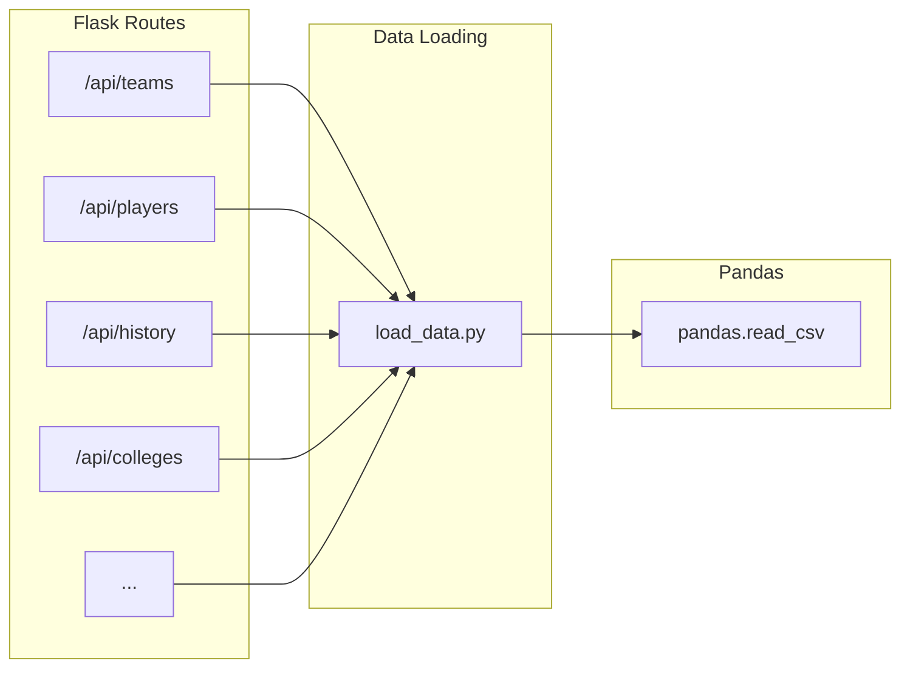

# Management Commands for DB actions and Post Requests

- Todays lecture will cover two topics: management commands and post requests
- They are a bit unrelated, but both are required for the next few part of the project.

## Manipulating the database outside of Flask

- Last time we worked on connecting our sqlite database to python.
- Our API, based on the Flask library will use similar functionality
- In practice we frequently use commands to access our services in ways that aren't necessary aligned with the core functionality of our service. 
- For example, in our Flask App we will send and receive information about stocks. There are many other useful sql functions that we will want to execute that don't fit into this paradigm and forcing them into the Flask framework would create a bad abstraction. 
- Since we want the access to the database to be available outside of `flask` we will put the configuration inside an environment variable that we pass through to the dockerfile as we have done in the past. 
- We will create a set of `make` commands inside our makefile which will call a python file called `db_manage.py` that handles the management commands. 
- To tell the management command which of the operations we are interested in it running we will use [`argparse`](`https://docs.python.org/3/library/argparse.html) to allow for passing of arguments to the python function.
- The following management commands will be created:

| Command | Description | 
| --- | --- | 
| `db_create` | This will create a database. It will not run if there are any issues in the configuration, such as the file already existing. |
| `db_rm` | This will remove the database (by deleting the file in the case of sqlite) | 
| `db_load` | This will create the specific tables that we want to load as well load the the data into those tables |
| `db_clean` | The clean command is a placeholder for running `db_rm`, `db_create` and `db_load` in order. It is a convenience function that just calls the other functions above. | 

Another command will be created `db_interactive` which is _not_ an official management command but will be used to access the sqlite database.

- Lets parse how this works using the example code in [this example repository](../lecture_examples/10_pipeline_1/). 

- Starting with our [`makefile`](../lecture_examples/10_pipeline_1/Makefile):

```
IMAGE_NAME=bball_app
DB_PATH=/app/src/data/bball.db

.PHONY=build notebook interactive run \
	db_clean db_create db_load db_rm db_interactive

COMMON_DOCKER_FLAGS= \
	-v $(shell pwd):/app/src \
	-e FLASK_APP=/app/src/app.py \
	-e FLASK_DEBUG=1 \
	-e FLASK_ENV=development \
	-e DB_PATH=$(DB_PATH) \
	-e DATA_DIR=/app/src/data \

build:
	docker build . -t $(IMAGE_NAME)

interactive: build
	docker run -it \
	$(COMMON_DOCKER_FLAGS) \
	$(IMAGE_NAME) /bin/bash

notebook: build
	docker run -it -p 8888:8888 \
	$(COMMON_DOCKER_FLAGS) \
	$(IMAGE_NAME) \
	jupyter notebook --allow-root --no-browser \
	--port 8888 --ip=0.0.0.0

flask: build
	docker run -p 4000:5000 \
	$(COMMON_DOCKER_FLAGS) \
	$(IMAGE_NAME)

db_create: build
	docker run $(COMMON_DOCKER_FLAGS) $(IMAGE_NAME) \
		python /app/src/app/data_utils/db_manage.py db_create

db_load: build
	docker run $(COMMON_DOCKER_FLAGS) $(IMAGE_NAME) \
		python /app/src/app/data_utils/db_manage.py db_load

db_rm: build
	docker run $(COMMON_DOCKER_FLAGS) $(IMAGE_NAME) \
		python /app/src/app/data_utils/db_manage.py db_rm

db_clean: build
	docker run $(COMMON_DOCKER_FLAGS) $(IMAGE_NAME) \
		python /app/src/app/data_utils/db_manage.py db_clean

db_interactive: build
	docker run -it $(COMMON_DOCKER_FLAGS) $(IMAGE_NAME) \
	sqlite3 -column -header $(DB_PATH)
```

Looking at the above we can see a few changes additions from the previous examples. 

1. We added a variable representing the docker flags that we use on all of our commands. This helps us avoid violating te DRY principle. 
2. We created a new environment variable `DB_PATH` which specifies a location (inside the container) where the database file will exist.
3. We added another command to enter the sqlite database interactively.
4. For the database management commands we have an argument after the command that is going to be passed that command. In the next section we'll analyze `db_manage.py` command.


- Looking at [`db_manage.py`](../lecture_examples/10_pipeline_1/app/data_utils/db_manage.py) we find the following at the bottom inside the `main` logic:
  
```python

if __name__ == "__main__":
    command_list = ["db_create", "db_load", "db_rm", "db_clean"]
    parser = argparse.ArgumentParser(description="Manage the SQLite database.")

    parser.add_argument(
        "command", choices=command_list, help="Command to execute"
    )

    args = parser.parse_args()
    csv_path = DATA_DIR + "/all_seasons.csv"
    table_name = "player_stats"

    if args.command == "db_create":
        create_empty_sqlite_db()
    if args.command == "db_load":
        create_and_load_basketball_data(csv_path, table_name)
    if args.command == "db_rm":
        rm_db()
    if args.command == "db_clean":
        rm_db()
        create_empty_sqlite_db()
        create_and_load_basketball_data(csv_path, table_name)
```

The first few lines of this command specify the available commands that can be used in the argument. If we want to add an additional command we will need to add an element to the list since the `argparse` library uses the `command_list` to limit the available choices.

- We can also see in this command that the management commands are being translated into python functions that we understand like any other python file.

## Converting our code base to SQLite

- If we run `make create` and `make load` we should now have our data loaded into sqlite. 
- Currently our code base is using pandas and `read_csv` to load all of our data (much like our project). We now want to change that to use the sqlite database.
- Luckily we have a _very good abstraction_ for how to load that data. That very good abstraction is that we have all of our data loading run through a single file.
- If we replace that single file with something that points to our SQL database rather than the CSV file then we will, with only a small number of lines of code being changed be able to run our DB off of SQL!



- If we look at [our loading utilities file](../lecture_examples/10_pipeline_1/app/data_utils/loading_utils.py) we can find two functions of interest:

```python

def load_data_pandas():
    """Previous code
    loads to a DF
    """
    file_path = "/app/src/data/all_seasons.csv"
    df = pd.read_csv(file_path)
    df = df.loc[
        df.season == "2022-23",
        [
            "player_name",
            "college",
            "team_abbreviation",
        ],
    ]

    # load_data_sql()
    return df


def load_data():
    """
    Loading data with SQL
    """
    conn = create_db_connection()

    query = """select player_name,
            college,
            team_abbreviation
        from player_stats
    where season = '2022-23';"""

    df = pd.DataFrame(execute_query_return_list_of_dicts_lm(conn, query))

    return df

```

- The first function is our previous version of loading data and the second one converts it to SQL-based system.

- Importantly if we start the flask app just changing _this single function_ allows for the entire backend of the code base to change to a new type!

- One of the hallmarks of a good abstraction, such as the above, is that making significant changes along a single line of work (such as the database) is easy to do. 

## Sending data to our server

- Up to now we have only gotten data from our server, we now want to be able to insert data into our server. 
- Before starting, an important framework when working with data is CRUD

| | HTTP / Requests | Good Status Code | 
| -- | -- | -- | 
| C - Create | POST | 201 |
| R - Read | GET | 200 | 
| U - Update | PUT/PATCH | 200 |
| D - Delete | DELETE | 204 | 

- Note that the status codes for what a "good" request is aren't always 200 which means that we have to be careful when we look at a request to make sure that we accept it properly or not. We can't condition on 200 being good as there are other codes of the form 2xx which maybe returned. 

- If we look at the routes file for the [player routes](../lecture_examples/10_pipeline_1/app/api/players/routes.py) we can find an example of a route that uses a `POST` request to insert data into our table. 

- If we send a post request with a JSON object in the body, such as demonstrated in the python code below (or you can use postman or another tool for sending requests) we can see that the data is being inserted into the database and stored there. 

```python
import requests
import json

url = "http://127.0.0.1:4000/api/players"

payload = json.dumps({
  "player_name": "Nick Ross 3",
  "college": "UCDavis",
  "team": "GSW"
})
headers = {
  '': '',
  'Content-Type': 'application/json'
}

response = requests.request("POST", url, headers=headers, data=payload)

print(response.text)
```


The code in the player route file looks like:

```python
def add_player_route():
    try:
        data = request.get_json()

        print(data)
        # This returns the information in the body of the request

        # Validate required fields
        if not data.get("player_name"):
            return jsonify({"error": "player_name is required"}), 400
        if not data.get("team"):
            return jsonify({"error": "team is required"}), 400

        # Add player with optional college
        add_player(
            data
        )

        return jsonify({
            "message": f"Successfully added player: {data['player_name']}",
            "player": {
                "name": data["player_name"],
                "team": data["team"],
                "college": data.get("college")
            }
        }), 201

    except Exception as e:
        return jsonify({"error": f"An error occurred: {str(e)}"}), 500
```

- What we see is that the route loads the data from the request body using the `request.get_json()` function. This is important to note, if we send the request with an improper `Content-type`, this method will not be available and the request will not be processed correctly. 

- This route level command calls the function `add_player` which does exactly what you think, it inserts the player information into the table.
