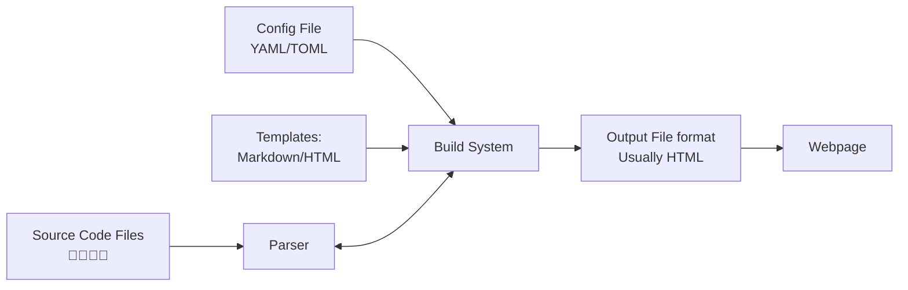

# Autodocs

## Motivation

- When we write software the most natural place to put information about specific aspects of the code is in the code itself. This makes it easy for other developers to know what we are thinking and also makes it easy to keep up to date.

- The downside of putting comments in code is that they aren't naturally exposed to the outside world as only developers tend to read the code and information therein.

- To create documentation we then have a few options:
  - Write a manual or website which contains all of our documentation
  - This is what we used to do, but the downside of this is that things become out of date as all changes in code would necessitate a verification of the documentation.
  - "It's always out of date" was a common refrain.
  - This was super-annoying, especially on larger teams.
- There were some other solutions that people used:
  - Require documentation to be a part of the job by baking in "no code submission" allowed time. E.g. if we wanted to launch on Thursday then we would stop call coding on Monday and require documentation tasks to be done on Tuesday and Wednesday before launch.
    - Downside is that after pushing to launch something documentation wasn't exactly a priority of developers energy. Manuals were "tacked on" and on especially long projects developers may not remember the logic and details of all complex decisions.
  - Hiring technical writers (which is a job that is going away).
    - Expensive.
    - This job is going away due to LLMs (IMO).
- The most common solution today is to use Autodocs or documentation build systems which connect directly to the code base and parse it as an input. 
- By reading over the code base the system extract relevant documentation and formats it be live on a website or other human accessible system. 
- These types of source code parsers are generally language specific as they rely on commenting systems specific to the language itself. 

| System | Notes | 
| --- | --- |
| [Sphinx](https://www.sphinx-doc.org/en/master/) | <ul><li>Flask, Django and other projects use this</li><li>Complex, full featured system</li></ul> | 
| [MkDocs](https://www.mkdocs.org/) | <ul><li>A lot of users</li><li>Note as powerful as Sphinx, but an order of magnitude less complex</li><li>Easier to set up and get running</li><li>Frequently used, especially in smaller projects.</li></ul>
| [Swagger](https://swagger.io/) | <ul><li>Swagger docs are used for documenting APIs</li><li>Swagger docs are also used an inputs to other systems, such as Postman.</li></ul>
| [Jupyter Book](https://jupyterbook.org/en/stable/intro.html) | <ul><li>A relative newcomer, but gaining steam especially for documentation that is to be printed.</li></ul> | 
    
- If I was starting a project today and I expected to work on it for more than 1 year I would use Sphinx, but for anything smaller I would use MkDocs. In my experience it is just a touch easier to set up and get running and while there are some limitations, you probably won't him them on a smaller project. Sphinx (for example) uses something called [reStructuredText](https://docutils.sourceforge.io/rst.html) rather than markdown. While reStructuredText is not difficult, since we already use markdown for github it is another thing that needs to be learned.

## How does it work



- The system diagram above highlights the major components of an autodoc system. You have a build system which generates output files based on a configuration file and a set of templates. 
- The templates are usually in markdown and leverage a template language, such as [Jinja](https://jinja.palletsprojects.com/en/stable/) (the documentation for this site uses Sphinx!)
- Most autodoc systems will come with their own lightweight webserver to make your life easier, rather than having to spin one up yourself.
- Many autodoc systems rely on _themes_ to stylize the documentation. Once you start using autodocs you will be able to recognize many of these themes across different packages and libraries.  

## Setting up MkDocs and using it.

- The directory called [autodoc](../lecture_examples/14_autodocs/) contains a working example of using autodocs. We will use this to cover how to set up `MkDocs`
- Just like any other project we will have to add some packages to our `requirements.txt` file. In this case we added the following:
```
mkdocs==1.6.1
mkdocs-get-deps==0.2.0
mkdocs-autorefs==1.2.0
mkdocs-material==9.5.45
mkdocs-material-extensions==1.3.1
mkdocs-terminal==4.6.0
mkdocstrings==0.27.0
mkdocstrings-python==1.12.2
```

Note all of these are required, some of them are specific to the themes that we will play with.

- There are (roughly) three sets of dependencies above:
  - Those relate to the theme will we use (`material` and `terminal`)
  - Those related to the core library
  - `mkdocstrings-python` which is the parser that will be used. 

- We will also add a function to our [`Makefile`](../lecture_examples/14_autodocs/Makefile) in order to build and run autodocs:

```
autodoc: build
	docker run -it -p 4040:4040 \
	$(COMMON_DOCKER_FLAGS) \
	$(IMAGE_NAME) \
	mkdocs serve --dev-addr 0.0.0.0:4040 -f /app/src/api-docs/mkdocs.yml

```

- This will start our documentation server on port 4040. We will explain a bit more about how this works in the following sections.

### Starting up a new project

- Once the `requirements.txt` has been updated we can go into the container in interactive mode (using our `make interactive` command) and set up a new project by typing `mkdocs new my-project`. **Note: my-project is just a placeholder, you should not use it and instead choose a project name suitable for what you are working on, such as `api-docs`**.
- Running this will create a set files and directories that will look (roughly) like the below text tree

```
api-docs/
├── docs/
│   ├── index.md
├── mkdocs.yml
└── site/                          # Created after mkdocs build
    ├── index.html
    ├── api/
    │   ├── endpoints/index.html
    │   └── authentication/index.html
    ├── guides/
    │   ├── getting-started/index.html
    │   └── installation/index.html
    ├── reference/
    │   └── configuration/index.html
    ├── assets/
    │   ├── images/
    │   ├── javascripts/
    │   │   └── bundle.js
    │   └── stylesheets/
    │       └── main.css
    ├── search/
    │   ├── search_index.json
    │   └── search.js
    └── sitemap.xml
```

- Note that everything in `site` is created only _after_ we have run our first build.
- The important files that we want to look at are:
    1. `mkdocs.yaml` which is the configuration information for our project.
    2. `index.md` which is our first template.

### Configuration File

- The file `mkdocs.yaml` contains the configuration information for our doc project:


```
site_name: Basketball API
nav:
  - Home: index.md
  - About: about.md
  - APIDocs: api_docs.md
# theme: terminal

docs_dir: docs

theme:
  name: material
  features:
    - navigation.sections
    - navigation.expand
    - navigation.instant
    - navigation.tracking
    - toc.integrate
  font:
    text: Roboto
    code: Roboto Mono
  palette:
    - scheme: default
      primary: indigo

plugins:
  - mkdocstrings:
      handlers:
        python:
          paths: [..]
          options:
            load_external_modules: true
            show_type_annotations: false
            show_root_heading: true
            heading_level: 2
            show_source: true
            docstring_section_style: spacy
```

- Starting from the top we see that this provides a `site_name` which can be changed to any text, but by default is the name provided when you started the project.
- The `nav` section outlines what pages are going to be available. Basically this points to specific templates that are going to be used. In this case we have 3 templates a `Home` page (which will be rendered from `index.md`) an `About` page (rendered from `about.md`) and an `APIDocs` page rendered from (`api_docs.md`).
  - Note that these are being rendered _to_ html _from_ markdown templates. This configuration file is just telling the build engine where to look for templates to create the pages.
- the `docs_dir` sets up what are called []`static assets` (or static files)](https://cloudinary.com/glossary/static-assets) which are files copied to the site directly witout any change. In this case we will add an image and we want that copied from our templates to the final site which is why we need this.
- The line `# theme: terminal` is a commented out line for using a different theme. Once the page is up and running I recommend uncommenting it out and commenting out the information related to the material theme to see how drastic a change it can be.
- The section of the `yaml` file related to `theme` and the `mkdocsstrings` handles specific configuration information for the specific theme and how to process the python files. These are easy enough to research and play around with once we get the site running.

### Templates

- In our example we have three template files, but you can have any number of templates. 
- When we use `mkdocs` the configuration file tells us where to find the templates to render. Each of the templates is then rendered individually.
- The `index.md` templates contains almost nothing while the `about.md` contains the NBA logo and some text. It also demonstrates that we can insert `html` directly into the file if we want. 
- The most interesting of the templates is `api_docs.md` which contains the actual documentation templates. In this file we see a few blocks like this:

```
::: app.api
    options:
      members: true
      show_root_heading: true
      show_submodules: true
      show_source: true 
      recursive: true
      show_docs_block: true
```

- The important part of this are the `:::` which is a directive telling the parser to look in app.api for python files. The options underneath this are specific options to the parser.
- In the case of our file we directly specify all of sub modules we want the autodocs to parse.

## \[IMPT\] Finding files and functions

- In this section we will look at three important notes before we start our server.

### Finding Files
- Importantly the `mkdocs` parser will only look for files if they think that they are inside a module. This means that we have to put `__init__.py` in every subdirectory we want to be discovered. 
- While this is annoying, it isn't the end of the world, but when you run autodocs keep in mind that you will need to put these files into directories and subdirectories for this to work.

### Finding Functions
- The default settings we are using will only analyze _functions_ and _objects_ inside a python file.
- If you have code inside the root of the file it may not be found. For example, in the root of the file and inside a `if __name__ == '__main__'` block will _not_ be discoverable by the auto doc parser that we have set up.
- This is yet another reason to put code inside functions.

### Finding Modules
- Autodoc module discovery tends to be a bit different than the normal python interpret. 
- You generally will need to be more explicit, especially about modules in the same directory. 
- For example, the file [db_manage.py](../lecture_examples/14_autodocs/app/data_utils/db_manage.py) references the module in the same directory as it (`loading_utils`). We are calling this with a relative path and thus we need to add `.`, so that the import look like `from .loading_utils import ...` instead of `from loading_utils import ...`.
- Why do we need to do this? 
  - Because the parser is being called from another directory (in this case the root of the repo) it will look in the root of the repo for `loading_utils` and not find it. 
  - All the rest of our imports are called using the full path `app.data_utils.loading_utils` which is consistent with how `mkdocs` is being called.
  - When we call `db_manage.py` we are just running the script directly in a way that affords us not having to specify the full path.

## Running the autodocs

- Once the above is complete you should be able to type `make autodocs` and then navigate to `localhost:4040` to see the docs appear! 
- Autodocs will generally rebuild if it detects a change in some files, but the detection isn't perfect so you may need to stop and restart with regularity when debugging issues.

## Things to try & notice
- Try changing the theme to `terminal` by commenting out the material based theme options and un-commenting out the terminal ine.
- Look at how Notes and Warnings are being rendered (in the `list_colleges_per_team(team)` call).
- Also check out what is (docstring) and isn't being rendered (other comments).