# Testing

- Testing is the process of systematically evaluating software to:
  1. Verify performance
  2. ID defects and other issues
  3. Validate technical and business requirements
  4. Ensure software components work together as expected.

- Testing can cover both:
  - _functional_ aspects of the code "Does the code work?"
  - _non-functional_ aspects of the code "How _well_ does it work?"

- In general the way testing works is that we specify an action in our code, the expected result and then compare. 

- The following is an example demonstrates the concepts behind running a test.

```python
def sum_two(x,y):
    """Sum Two Functions"""
    return x + y

def test_sum_two():
    """Test for our function"""
    assert sum_two(1,2) == 3
    assert sum_two(-1,1) == 0
```

- There are two tests being run inside of our one test function (`test_sum_two`). These two tests evaluate the function `sum_two` against two conditions that we know the answer to. 

- This test uses the `assert` function, which we will discuss in the next section, to return an error if something is amiss.

## Assert Function

- Every programming language has a version of this function, which is designed to return an error (or break) when a specific condition is not met.
- The basic idea of `assert` is that if the boolean condition fails then an error (`AssertError`) is raised.
- The structure of an assert is as follows:

```
assert EXPR1 [, EXPR2]
```

where EXPR1 is a boolean expression and the (optional) EXPR2 is what is returned if the boolean fails. If we wanted to write the following assert function

```python
assert x == 2, "X is not equal to 2"
```

as a standard `if` statement it would roughly look like:

```python
if not x == 2:
    raise Exception("X is not equal to 2")
```

Note that these are not the exact same because the error types are different.

## Types of tests

- Now that we have knowledge of how a test works, lets dig into the specifics of the _types_ of tests that are commonly found.
- In practice most organizations use a mix of these different tests on different parts of their code base. Many organizations, including most of the ones that I have worked with, tended to have many ad-hoc tests that were reactive to how their organization had experienced bugs in the past. So that if a bug occurred then a test was added. 
- There is also a type of development strategy called "Test Driven Development" ("TDD") which is a way of building software which focuses on building tests _before_ writing the code. The belief is that by having a firm set of tests in place that we can more efficiently write compatible code.
- Below we will define a number of commonly used tests. There are three types of interest for this course (End to End, Integration and Unit Tests). This diagram represents two of them.

```mermaid
graph LR
    DB[(Database)]
    
    subgraph box1[Connection]
        circle1((Unit Tests))
    end
    
    subgraph box2[Data Processing]
        circle2((Unit Tests))
    end
    
    subgraph box3[Routes]
        circle3((Unit Tests))
    end
    
    User([👤 User])
       
    DB --> |Integration Tests| box1
    box1 --> |Integration Tests| box2
    box2 --> |Integration Tests| box3
    box3 --> User
    
```




- The last type, end-to-end testing encapsulates all aspects of the system as we will see below.

### Unit Tests
- Tests a specific "Unit" or individual component (function, class, module) to verify that it works as expected. 
- Note that the unit is from a _code_ perspective, not from a user perspective.
- Unit tests are the most common and easiest to write. Our first example, testing `sum_two`, is a unit test.
- Looking at the previous diagram, of the system that we have built, we would expect unit tests to mirror the functional form that we have written.
- We use them because they are:
  - fast and easy to write.
  - Helps to document behavior
  - Easy to identify where and what is broke.
- There are some downsides:
  - lots and lots of boilerplate and mocking required to get them up and running.
  - There are large classes of issues that these will not catch.
  - It is easy to have a very large set of tests that will not catch basic system issues.

### Integration tests

- Integration tests are tests that verify the interface between units and specifically how different components work together.
- If we had a function which loaded data and another function which cleaned the data then we could build an integration test that looked liked this:

```python
def test_process_and_load():
    raw_df = load_data()
    processed_df = process_data(raw_df)

    assert raw_df.shape[0] == processed_df.shape[0]
    assert all(name.istitle() and name.isalpha() for name in processed_df['first_name'])

```

- In this case we have _two_ tests written for this _one_ test function. The first assert verifies that the number of rows in the raw data and processed data are the same. This verifies that we did not add or remove any rows in our cleaning process.
- This type of "overloading" of asserts (e.g. more than one per test function) is common and generally expected because we frequently need multiple commands to test the full spectrum of what we are interested in verifying.
- The second assert verifies that the column "first_name" in our data is title cased _and_ only contains alphabetical characters.
- Integration tests like the above are very common in multilayered systems to make sure that interfaces between those layers don't break.
- In the project example we are building we have three layers for our flask system (connection, data processing and routes). In order to build integration tests we would have to mock up data in order to test each interface, which would be time consuming.
- Not only do these systems tend to be difficult to construct, they are also slower to execute than integration tests since they often rely on loading and executing multiple units within a system.

### End-to-end tests

- The last major type of test is called "end-to-end" ("E2E") testing and involves simulating, as close to possible, the entire system from top-to-bottom.
- In our system an E2E test would be sending a request to flask, generating a result and verifying that result. 
  - On an aside -- this is basically what the autograder for this class does.
- Pros:
  - Usually closest to a full system evaluation.
  - Easy to build tests that represent what a user experiences.
  - Validates multiple levels and points of integration.
- Cons:
  - Tend to be most complex to set up.
  - Tends to be slower to run because they involve so much.
  - Brittle -- because they are specific to the entire system working properly they can frequently break in ways that do not inform on the system's actual state.
  
### Other tests

- While there are a myriad set of tests that can be run on a system, the above covers the functional definitions that you would expect in most common systems.
- Often systems will include additional suites of tests.
- If performance (speed, resource usage) is important than tests can be created to measure and report on these aspects of the system.


## Tests for this course

- In this course we will focus mostly on end-to-end testing, which is the dominant method of testing for API backend systems, such as the one we are building.
- Specifically we will write tests which first send a request and then validate the response. 
- We will be using [Pytest](https://docs.pytest.org/en/stable/) to run and report on these tests.
- Before we go into the implementation details we need to cover _schema_ validation, which is an important tool in our validation toolkit.
- Schema validation describes creating an expected result format and then verifying that the response returned by the system aligns with this system description.
- In the next section we'll talk about the details of this.


## JSON Schema Validation

- In testing we want a method to describe data in a light manner for validation purposes. There are a lot of tools for doing this (Pydantic and Cerberus are two others), but we will use [Json Schema](https://json-schema.org/) which is a bit simpler and, IMO, a bit easier to use.
- The basic idea is that you write a JSON object using their language to define the expected data.
- You then run `jsonschema.validate` against the object and it will return any non-conforming code.
- Lets read a few and then go over the specification in a bit more detail.

## Some Examples
```json
// Example 1: List of Strings Schema
{
  "type": "array",
  "items": {
    "type": "string"
  }
}

// Valid data for Example 1:
["apple", "banana", "cherry"]
```

```json
// Example 2: List of Numbers Schema
{
  "type": "array",
  "items": {
    "type": "number"
  }
}

// Valid data for Example 2:
[1, 2.5, 3, 4.7, 5]
```


```json
// Example 3: Dictionary with List of Strings Schema
{
  "type": "object",
  "properties": {
    "fruits": {
      "type": "array",
      "items": {
        "type": "string"
      }
    },
    "count": {
      "type": "integer"
    }
  }
}

// Valid data for Example 3:
{
  "fruits": ["apple", "banana", "cherry"],
  "count": 42
}
```

```json
{
  "type": "object",
  "properties": {
    "name": { "type": "string" },
    "age": { "type": "integer", "minimum": 0 }
  }
}
```

## JSON Schema Types and Their Properties

### string
- **minLength/maxLength**: Control string length
- **pattern**: Regular expression pattern
- **format**: Predefined formats (email, date-time, uri, etc.)
- **enum**: List of allowed values

```json
{
  "type": "string",
  "minLength": 2,
  "maxLength": 100,
  "pattern": "^[A-Za-z]+$",
  "format": "email"
}
```

### number/integer
- **minimum/maximum**: Value range
- **exclusiveMinimum/exclusiveMaximum**: Exclusive range
- **multipleOf**: Number must be multiple of value
- **enum**: List of allowed values

```json
{
  "type": "number",
  "minimum": 0,
  "maximum": 100,
  "multipleOf": 0.5
}
```

### boolean
- Simple true/false validation
- **enum**: Can restrict to specific boolean value

```json
{
  "type": "boolean"
}
```

### array (list)
- **items**: Schema for array items
- **minItems/maxItems**: Array length constraints
- **uniqueItems**: Ensure unique values
- **contains**: Array must contain item matching schema

```json
{
  "type": "array",
  "items": { "type": "string" },
  "minItems": 1,
  "maxItems": 5,
  "uniqueItems": true
}
```

### object
- **properties**: Define object properties
- **required**: List of required properties
- **additionalProperties**: Control extra properties
- **minProperties/maxProperties**: Object size limits
- **dependentRequired**: Property dependencies
- **patternProperties**: Properties matching pattern

```json
{
  "type": "object",
  "properties": {
    "name": { "type": "string" },
    "age": { "type": "integer" }
  },
  "required": ["name"],
  "additionalProperties": false,
  "minProperties": 1
}
```

## Demonstration & Coverage calculation

- Not that we have a good understanding of foundations of testing we will take a look at the example [here](../lecture_examples/15_testing/) which contains a working example of the testing framework on our basketball API.
- When you run `make test` in this directory you will see something like the following appear.

```
============================= test session starts ==============================
platform linux -- Python 3.10.15, pytest-8.3.4, pluggy-1.5.0 -- /usr/local/bin/python3.10
cachedir: .pytest_cache
rootdir: /app/src
configfile: pyproject.toml
plugins: anyio-4.6.2.post1, cov-6.0.0
collecting ... collected 3 items

test/test.py::test_app_exists PASSED                                     [ 33%]
test/test.py::test_app_is_testing PASSED                                 [ 66%]
test/test.py::test_player_response PASSED                                [100%]

---------- coverage: platform linux, python 3.10.15-final-0 ----------
Name                                Stmts   Miss  Cover   Missing
-----------------------------------------------------------------
app/__init__.py                         0      0   100%
app/api/__init__.py                     0      0   100%
app/api/colleges/__init__.py            0      0   100%
app/api/colleges/routes.py             21      9    57%   21-25, 45-46, 59, 64
app/api/players/__init__.py             0      0   100%
app/api/players/routes.py              44     25    43%   28-29, 41-45, 57-66, 87-93, 108-109, 114, 119
app/api/teams/__init__.py               0      0   100%
app/api/teams/routes.py                15      4    73%   31-33, 46
app/data_utils/__init__.py              0      0   100%
app/data_utils/db_manage.py            23     23     0%   6-47
app/data_utils/loading_utils.py        80     45    44%   25-35, 44-54, 74, 123-138, 148-150, 159-185, 200-212, 223-230, 242-244
app/data_utils/sql_utils.py            43     30    30%   25-43, 65, 83-99, 114-144, 153-160, 172-179
app/logger_utils/__init__.py            0      0   100%
app/logger_utils/custom_logger.py      12      0   100%
app/route_utils/__init__.py             0      0   100%
app/route_utils/decorators.py          35     14    60%   32-35, 52-57, 74-84
-----------------------------------------------------------------
TOTAL                                 273    150    45%


============================== 3 passed in 0.94s ===============================
```

This demonstrates a few features we want to highlight:

- It shows the tests that were run, how long they took, how many passed and failed.
- One of the interesting features that pytest has (with an optional module that we will install) is the notion of _coverage_ which is a representation of how much of the code base has been tested. 
- Coverage is an important concept and is often baked into github. If you go to the pandas github page for example you'll see a badge stating the `codecov` level which is a measure of this concept.