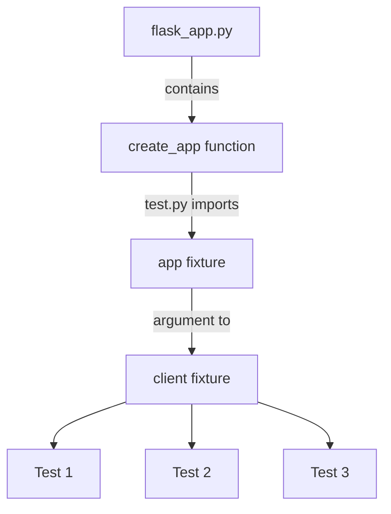

# Pytest 

- We will continue our discussion of testing by going into the details of how to implement testing inside our system. There are a number of things that we will need to do to get this complete, each will be highlighted below.
  - `requirements.txt` update
  - file structure 
  - `makefile` update
  - `test/test.py` file

## Requirements.txt

- We will need to add two packages to get our testing to work: `pytest` and `pytest-cov`.
- The second of these handles the coverage calculations that we are interested in seeing.
- As per usual, to get these I went into `interactive` mode and ran `pip install` followed by `pip freeze` to identify the package.

```
pytest==8.3.4
pytest-cov==6.0.0
```

## File structure

- When running tests we generally put the test code outside of the main directory of the source code. 
- For big projects this makes lots of sense, there is already so much code in the repo that breaking it apart at a higher abstraction / file system level will make our code a lot easier to read.
- A common framework for how to organize files for testing is a mirror strategy, such as the below:

```
.
├── app/
│   ├── routes/
│   │   └── stock_routes.py
│   └── helpers/
│   │   └── decorators.py
│   └── ...
└── test/
    ├── routes/
    │   └── test_stock_routes.py
    └── helpers/
    │   └── test_decorators.py    
    └── ... 
```

Using a mirror strategy like this works well for unit tests because they align with the code. 

- Unfortunately this does not work as well with integration and E2E tests as those tests tend to cross the lines defined by the file.
- In these case we will just create a separate directory under `test` to handle these specific tests:

```
└── test/
    ├── e2e/
    │   └── test_e2e.py
    ├── routes/
    │   └── test_stock_routes.py
    └── helpers/
    │   └── test_decorators.py    
    └── ... 
```

Depending on the volume of the tests this can be an effective strategy, however I have seen others as test scope expands.

- Given the simpler nature of what we are doing here (and the small number of tests) we will add only a `test` directory and a `test.py` file inside that directory:

```
|── app/
└── test/
    └── test.py
```

- The one downside of this structure is that to be able to import things from the `app` directory we will need to modify our python path. Because the `test.py` file is down the file system path from `app` it will not naturally have access to things inside the `app` directory which is where the code lies. 
- We will see hot address this issue within the `test/test.py` file below.

## Our Makefile command

- The command that we use to run `pytest` in our `makefile` is a bit complex. In this section we will analyze what each piece of this command does. Note that this does require `pytest-cov` to be installed to handle the coverage reporting.

- Currently the command [in our makefile](../lecture_examples/15_testing/Makefile) looks like this:

```
pytest --cov=app /app/src/test/test.py --cov-report=term-missing -v
```

- Below you can find a description of each component and what it is used for.

| Component | Description | 
| --- | --- | 
| `pytest` |  The base command to run Python tests | 
| `--cov=app` | <ul><li>This flag enables coverage reporting through the pytest-cov plugin</li><li>The `app` part specifies the package/directory to measure code coverage for</li><li>It will track which lines of code in the `app` directory are executed during tests</li></ul> | 
| `/app/src/test/test.py` | <ul><li>The path to the test file(s) to run</li><li>In this case, it's running tests from a specific file named `test.py`</li><li>The path indicates it's located at `/app/src/test/test.py`</li></ul> | 
| `--cov-report=term-missing` | <ul><li>This configures the coverage report format</li><li>`term-missing` generates a terminal report that shows:</li><li>Coverage percentage for each file</li><li>Line numbers of code that wasn't executed during tests (missing coverage)</li><li>This helps identify which specific lines need additional test coverage</li></ul> |
| `-v` | <ul><li>Enables verbose output</li><li>Shows more detailed test execution information</li><li>Displays the name of each test as it runs</li><li>Shows additional details about test passes/failures</li></ul> |

When run, this command will:
1. Execute all tests in test.py
2. Track which lines of code in the `app` directory are run
3. Display detailed test results in the terminal
4. Show a coverage report with missing lines
5. Provide verbose output of the test execution

- You should verify that the options do what they are expected -- if you run without `-v` what does the output look like? What about the other options?


## pytest file

- There are a number of features that we want to call out in our `test/test.py` file. We will reproduce the file [here](../lecture_examples/15_testing/test/test.py).

```python
import sys
from pathlib import Path

import pytest
from jsonschema import validate

# Add the src directory to the Python path so we can import the app
sys.path.append(str(Path(__file__).parent.parent.resolve()))

from flask_app import create_app  # noqa E402


@pytest.fixture
def app():
    """Create and configure a test instance of the application."""
    app = create_app()
    app.config.update({
        "TESTING": True,
        # Add any test-specific configuration here
    })
    return app


@pytest.fixture
def client(app):
    """Create a test client for the app."""
    return app.test_client()


def test_app_exists(app):
    """Test that the app exists."""
    assert app is not None


def test_app_is_testing(app):
    """Test that the app is in testing mode."""
    assert app.config["TESTING"]


def test_player_response(client):
    """Test the /api/players endpoint."""
    HTTP_OK = 200

    schema = {
        "type": "object",
        "properties": {
            "players": {
                "type": "array",
                "items": {
                    "type": "object",
                    "properties": {
                        "id": {"type": "number"},
                        "player_name": {"type": "string"}
                    },
                    "required": ["id", "player_name"]
                }
            }
        },
        "required": ["players"]
    }
    response = client.get("/api/players")
    # Assert response is JSON
    assert response.status_code == HTTP_OK
    assert response.content_type == "application/json"

    # Assert we can parse the response as JSON
    json_data = response.get_json()
    validate(instance=json_data, schema=schema)
```


### Imports: app.py vs. flask_app.py

- The first section of the code is a bit complex but sets up the proper imports and import structure.
- Be starting note that in our code base we have renamed `app.py` to `flask_app.py`. Why did we do this?
  - We needed to do this because there is a directory `app` at the same level as `app.py` which makes it difficult to import structures from.
  - If we tried to import form `app` at this level python would not know which to import from -- the directory `app` or the file `app.py`
  - To avoid this we rename `app.py` to `flask_app.py`
- First, notice the line beginning `sys.path...`.
  - This lines adds the additional parent directories to the python path so that the current code is able to find them. 
  - Without this file we will not be able to import the flask app.
- Reading over the first few lines we can see that we end with importing the `create_app` function from the original `app.py` now renamed `flask_app.py`.

### Fixtures & Test Client

- The next section of the code is are two decorated functions: `client` and `app`.
- These two functions are decorated with `@pytest.fixtures`. 
- Fixtures are a special decorator which creates reusable components across tests.
  - These components can be anything: functions, data, other objects.
- Fixtures are required because tests often require specific assets which we want to reuse and tests are (by design) built in an isolated manner. We want our tests to run independently so that the result of one test does not effect the result of another.
- That same silo effect means that when we want to reuse something (such as run multiple tests against the same flask app) we need to use special language to define these objects as such.
- There are multiple reasons why we want reusability:
  - In our case, starting the flask app takes time and because we know the flask app has no state to worry about we can just start it once and then pass it around.
  - Mocking up a specific dataset is annoying and being able to reuse it over and over allows us to avoid wasting developer time.
- Looking over the code you can see that once the functions (`client` and `app`) are defined as fixtures we can pass them into the rest of the test functions. 
- You can see the flow in the diagram below.



- A final note on this -- when you look at the `client` fixture you'll see that it returns a client of the form `test_client`.
- This `test_client` is a simplified version of the flask server designed for testing. You can find more information about how it works [here](https://flask.palletsprojects.com/en/stable/testing/).

### Tests functions

- Once the client is created we can then set up test _functions_.
- A test function always begins with the name `test_`. Pytest uses this to find tests in the file. If you name it something else you may need to reconfigure `pytest` to be able to find the file.
- There are three test functions in the above file:

1. `test_app_exists` 
2. `test_app_is_testing`
3. `test_player_response`


- The first one verifies that the `app` fixture exists. This is a good check to make sure that the flask test app is working properly. 
- The second one verifies that the config property that we set on the app fixture is set to testing. Once again, this is just verifying that we are seeing what we should expect before launching into the more functional tests.
- The third test function `test_player_response` contains _three_ specific tests:
    1. Verify the status code using an assert on `response.status_code`
    2. Verify the content returned is what we expect using `response.content_type`
    3. Use the `validate` function to verify that the schema that the data returned by the response matches the schema specified.
   
- Importantly we want to make a difference between test _functions_ which can encapsulate multiple tests. Most test functions that we write will have multiple tests inside of them to verify the specific behavior.

- Looking closely at the last test function we can see that it accepts a _client_ as an argument. This client is _not_ defined in the "standard" manner in the python file, it is instead defined using the `fixture`.

### Exact Tests vs. Schema Tests

- In the homework assignment you will be asked to write both schema tests and _exact_ tests. An exact test, for the purpose of this class is one that validates the specific numbers that are returned by the application.
- Consider the following test, which is is in `test.py`. We will discuss it a bit below.

```python
def test_WAS_colleges_exact_response(client):
    expected_response = {
        "colleges": [
            "Texas A&M",
            "Iowa State",
            "Winthrop",
            "Southern California",
            "Kansas",
            "None",
            "Utah",
            "Arkansas",
            "Virginia",
            "Florida",
            "Gonzaga",
            "Oakland",
            "San Francisco",
            "St. Louis",
            "San Diego State",
            "Wisconsin"
        ]
    }

    response = client.get('/api/colleges/WAS/list')
    assert response.status_code == 200
    assert response.content_type == 'application/json'

    # Get the actual response data
    actual_response = response.get_json()

    # Verify the structure
    assert "colleges" in actual_response
    assert isinstance(actual_response["colleges"], list)

    # Sort both lists and compare
    assert sorted(actual_response["colleges"]) \
        == sorted(expected_response["colleges"])
```

- In this test we can see that there are five asserts inside the test function. As such, we would state that this has five tests inside the test function.

- There is not schema validation here, in the sense of using `jsonscheam`, since another function handled schema validation.

- This test focuses on the _exact_ response returned by the route. 

- Importantly, the final `assert` uses a `sorted` function on the response. The `sorted` is required because the API does not guarantee the order of the colleges being returned. So the API could still be working and the lists not be equal in that the elements could be in different orders.

- To avoid raising an error due to the order of the elements in the list, we sort both sides of the assert equality to make sure that they align.